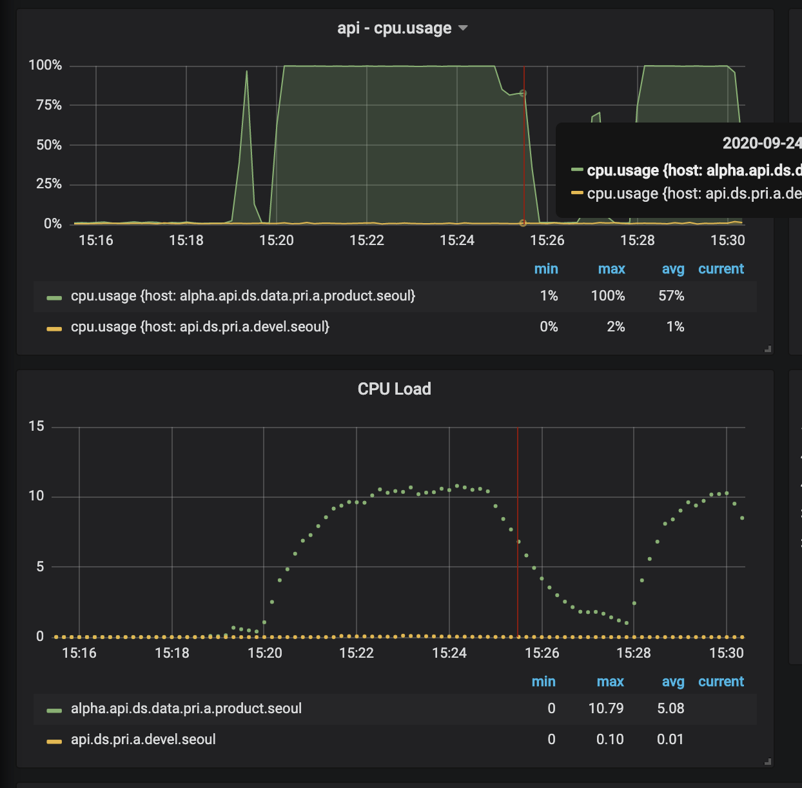
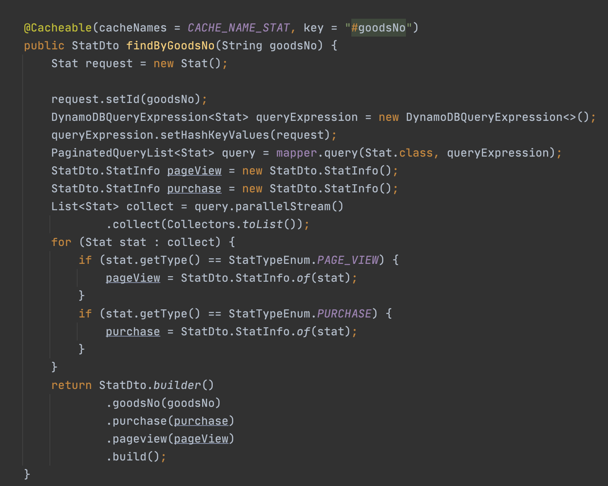
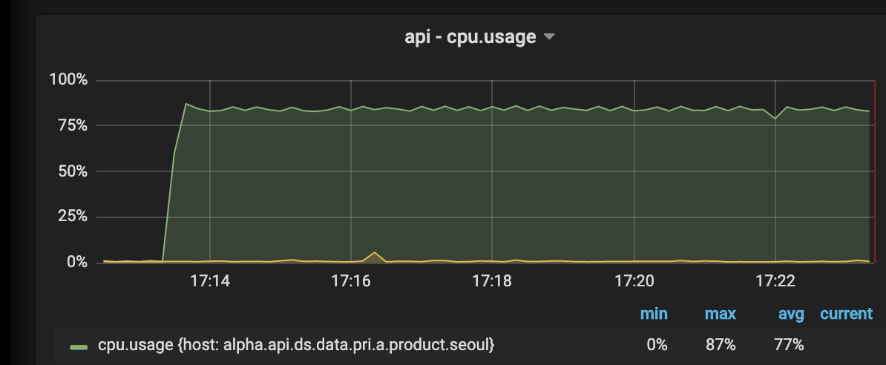
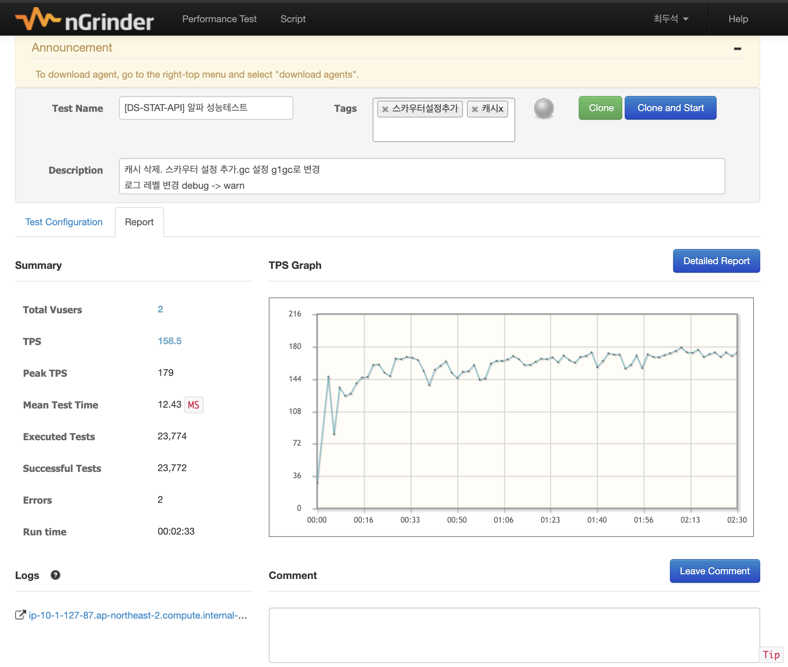

# 상품통계 범례 API 개발 완료 후 성능테스트 

API 개발을 끝낸 후 성능테스트를 해야해서 ngrinder 설치 후 테스트 수행을 시작했다. 

목표 성능 수치 : 180tps - 서버가 두대니 한대에 100정도만 나오면 좋겠다

**처참한 성능**

cpu 사용률 100% / cpu load 10.

**성능테스트 결과**

| TPS              | **46.3**     |
| :--------------- | ------------ |
| Peak TPS         | **54.5**     |
| Mean Test Time   | 173.42  `ms` |
| Executed Tests   | 13,698       |
| Successful Tests | 13,698       |

#### **문제가 무엇일까?**

##### **첫번째 의심.**

스카우터 xlog 를 확인해보았는데 DDB( dynamodb response 시간이 1.5초나 걸리는것을 확인.)

ddb 설정 및 rcu(읽기 용량) 설정을 늘렸다.

**하지만 결과는 변하지 않았다. ㅠㅜ (1)**

##### **두번째 의심**

JAVA DDB client 풀을 늘려야 하나? mybatis 의 db 커넥션풀같은게 있으니 해당 풀에 접근하고 해제하는데 오래걸려서 문제가 생기지 않을까? 하는 의심을 했다.

파격적으로 maxConnection 100으로 설정했다.

**하지만 결과는 변하지 않았다. ㅠㅜ (2)**

##### **세번째 의심.** 

Spring data dyanmodb 요 아이가 성능이 안나오나? 그러면 그냥 aws에서 제공하는 sdk 를 사용해서 해보자.

**하지만 결과는 변하지 않았다. ㅠㅜ (3)**

##### **포기. 서버 성능을 높이자**

**t3.small → c5.xlarge**

무려 cpu 4코어 짜리다. 

역시 돈이다! 기존 t3.small 보다 무려 2배 

| TPS              | **99**      |
| :--------------- | ----------- |
| Peak TPS         | **132**     |
| Mean Test Time   | 40.19  `ms` |
| Executed Tests   | 59,027      |
| Successful Tests | 59,023      |
| Errors           | 4           |

cpu 도 75% 사용. 그래도 높지만 기존 아이들 생각하면 엄청난 차이다. 좋네 이렇게 할까..? 

##### **다시 한번 더 코드를 확인 해보자.** 

유환성 팀장님 같이 코드를 보면서 의심되는 부분을 하나씩 확인해보았다. 

유 : 정확하게 무슨 일을 할까요? 나: 이런 저런 일을 하고 있어요. 유: 그럼 이건 무슨 일을 할까요? 나: 이건 이런 저런 일을 해요. 유: 혹시 로그 레벨은 info 인가요? 나: ...... debug 네요..

한가지 자기 변호를 해보자면 기존 회사에서는 alpha 는 개발이었다. 알파의 log level 을 debug 로 해놓은 상태였다.

| 무신사 | 기존회사 |
| :----- | :------- |
| devel  | alpha    |
| alpha  | beta     |
| prod   | release  |

#### 마지막 결과. 

| TPS              | **158.5**   |
| :--------------- | ----------- |
| Peak TPS         | **179**     |
| Mean Test Time   | 12.43  `ms` |
| Executed Tests   | 23,774      |
| Successful Tests | 23,772      |

**cpu 사용률**

**50프로 미만 정상동작 한다. ㅠㅜ 기쁘다..**

DDB RCU

여섯시쯤에 파랗게 뾰족하게 뒤어나온 아이가 테스트 했을때의 그래프이다. 

최대 30개까지 썼으니 운영에서 사용할땐 적어도 30이상으로 사용을 해야겠다.

## 결론. 

허무하지만.. 그래도 소스코드 문제가 아니어서 다행이었다.

여기서 얻은 교훈은 문제가 없다고 생각되면 설정부터 차근차근 하나씩 보면서 확인을 하자 

**로그 설정 DEBUG는 운영에 나가면 안된다.** 