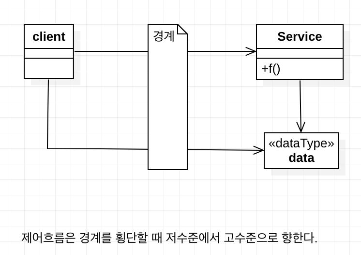
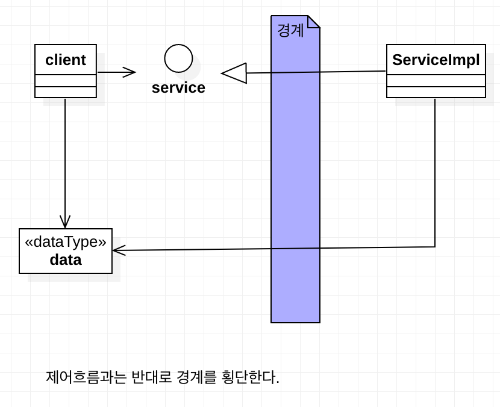
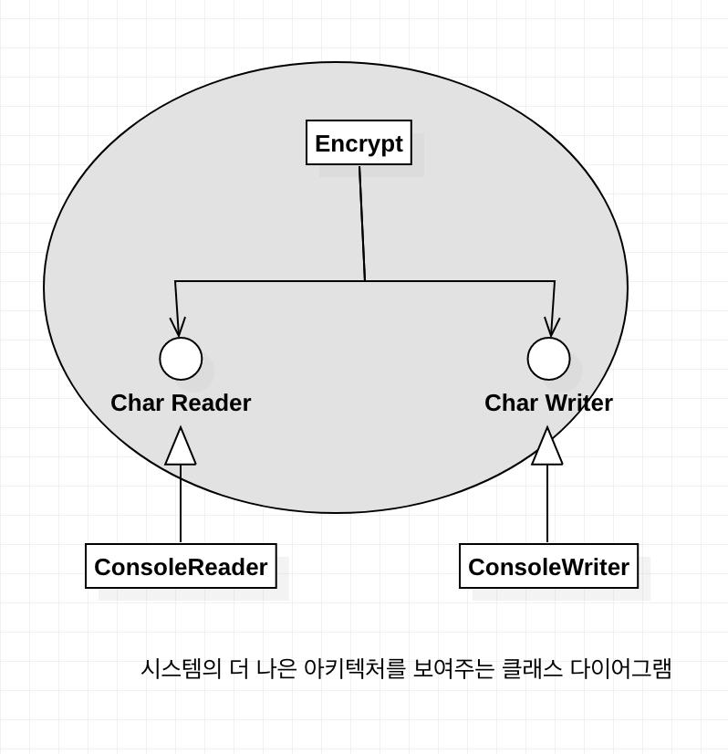
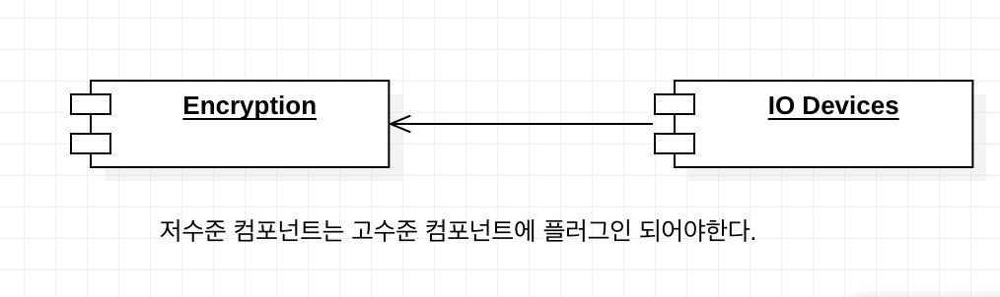
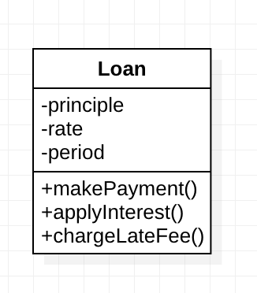

# 5부 아키텍처

## 18장 경계 해부학

> 시스템 아키텍처는 일련의 소프트웨어 컴포넌트와 그 컴포넌트들을 분리하는 경계에 의해 정의된다.

### 경계횡단하기
'런타임에 경계를 횡단한다' 함은 경계 한쪽에 있는 기능에서 반대편 기능을 호출하여 데이터를 전달하는 일에 불과하다.
적절한 위치에서 경계를 횡단하게 하는 비결은 `소스 코드 의존성 관리`

**why Source Code**

소스 코드 모듈이 변경되면 의존하는 다른 소스 코드 모듈도 변경되거나, 다시 컴파일해서 새로 배포해야 할지도 모르기 때문.

경계는 이러한 **변경이 전파되는 것을 막는 방화벽**을 구축하고 관리하는 수단

### 두려운 단일체

배포 관점에선 단일체(monolith) :  실행가능한 jar, 단일 exe 파일로 묶인 일련의 .net 바이너리등

단일체는 경계가 드러나지 않음 

> 단일체는 컴포넌트 수준으로 분리되지 않으므로, 배포할 때 개별 컴포넌트를 배포하는 대신 커다란 하나의 파일을 배포한다. 따라서 경계가 드러나지 않는다.

경계가 드러나지 않더라도 경계가 실제로 존재하지 않거나 , 경계가 무의미한 것은 아니다. 

최종적으로는 정적으로 링크된 단일 실행파일이더라도 그 안의 다양한 컴포넌트를 개발하고 바이너리로 만드는 과정을 독립적으로 수행할 수 있게 하는 일은 가치 있는 일이다.


* 가장 단순한 형태의 경계 횡단 
  * 저수준 클라이언트에서 고수준 서비스로 향하는 함수 호출




* 고수준 클라이언트가 저수준 서비스를 호출할때




모노리틱 구조의 실행파일이라도 규칙적으로 구조를 분리하면 프로젝트를 개발 , 테스트, 배포하는 작업에 큰 도움이 된다.

단일체에서 컴포넌트 간 통신은 매우 빠르고 값싸다. 통신은 전형적인 함수 호출이기 때문이다.


### 배포형 컴포넌트

아키텍처의 경계가 물리적으로 드러나는 경우: 동적 링크 라이브러리

Ex) .net dll, 자바 jar 파일, 루비 gem 등

컴포넌트를 dll, jar 파일 형태로 배포하면 따로 컴파일 하지 않아도 사용가능하다. 이는 배포 수준 결합 분리 모드에 해당한다, 배포 작업은 단순히 이들 배포 가능한 단위를 좀 더 편안한 형태로 묶는 일에 지나지 않는다. War 파일이나 directory 형태.

배포형 컴포넌트의 경계를 가로지르는 통신은 함수 호출이므로 매우 값싸다. 동적 링크와 런타임 로딩으로 인해 최초의 함수 호출은 오래 걸릴수 있지만 대체로 이들 경계를 가로지르는 통신은 매우 빈번할 수 있을것이다.

### 스레드

단일체와 배포형 컴포넌트 모두 스레드를 활용할 수 있다. 스레드는 실행 계획과 순서를 체계화 하는 방법에 가깝다. 

https://gmlwjd9405.github.io/2018/09/14/process-vs-thread.html

### 로컬 프로세스

물리적 형태를 띄는 아키텍처 경계로 로컬 프로세스가 있다. 

**로컬 프로세스간 통신**

* 소켓, 메일박스, 메시지 큐와 같이 운영체제에서 제공하는 통신 기능을 이용하여 통신

**로컬 프로세스 간 분리 전략**

* 소스 코드 의존성의 화살표는 단일체나 바이너리 컴포넌트와 동일한 방향으로 경계를 횡단.
* `항상 고수준 컴포넌트를 향함`
* 로컬 프로세스에서는 고수준 프로세스의 소스 코드가 저수준 프로세스의 이름, 물리주소 레지스트리 조회 키를 포함해서는 안된다.

### 서비스

**서비스**는 물리적 형태를 띄는 가장 강력한 경계

**서비스간 통신**

* 모든 통신이 네트워크 통신이라 가정

* 함수 호출에 비해 매우 느림

* 지연에 따른 문제를 고수준에서 처리할 수 있어야한다.

* 규칙

  * 저수준 서비스는 고수준 서비스에 '플러그인' 되어야한다.

  * 고수준 서비스의 소스 코드에는 저수준 서비스를 특정 짓는 어떤 물리적인 정보(ex) url) 도 포함해서는 안된다.

    

### 결론

단일체를 제외한 대다수의 시스템은 한가지 이상의 경계 전략을 사용한다.

대체로 한 시스템 안에서도 통신이 빈번한 로컬 경계와 지연을 중요하게 고려해야 하는 경계가 혼합되어 있음을 의미한다.

## 19장. 정책과 수준

> 소프트웨어 시스템이란 ? 정책을 기술 한 것

동일한 이유로 동일한 시점에 변경되는 정책은 동일한 수준에 위치하며, 동일한 컴포넌트에 속해야 한다. 서로 다른 이유로, 혹은 다른 시점에 변경되는 정책은 다른 수준에 위치하며, 반드시 다른 컴퍼넌트로 분리해야한다.


### 수준 (level)
**수준 **
'입력과 출력까지의 거리'
시스템의 입력과 출력 모두로 부터 멀리 위치할수록 정책의 수준은 높아진다. 입력과 출력을 다루는 정책이라면 시스템에서 최하위 수준에 위치한다.

**간단한 암호화 프로그램**
번역 컴포넌트는 이 시스템에서 최고 수준의 컴포넌트인데, 입력과 출력에서부터 가장 멀리 떨어져 있기 때문이다.

image 추가.


**주목할 점** 
데이터 흐름과 소스 코드 의존성이 항상 같은 방향을 가르키지는 않는다는 사실.


***잘못된 아키텍처***

```javascript
function encrypt(){
	while(true){
		writeChar(translate(readChar()));
	}
}
```


**개선된 시스템 아키텍처**



* ConsoleReader 와 ConsoleWirter는 클래스로 표현
  * 입력과 출력에 가깝기때문에 저수준이다.
* 고수준의 암호화 정책을 저수준의 입력/출력 정책으로부터 분리시킨 방식
* 단일 책임원칙과 공통 폐쇄 원칙에 따르면 동일한 이유로 동일한 시점에 변경되는 정책은 함께 묶인다.
* 고수준 정책, 입력, 출력에서부터 멀리 떨어진 정책은 저수준 정책에 비해 덜 빈번하게 변경되고, 보다 중요한 이유료 변경되는 경향이 있다.
* 소스 코드의 의존성의 방향이 고수준 정책을 향할 수 있도록 정책을 분리했다면 변경의 영향도를 줄일 수 있다. 


**Encrypotion** 컴포넌트는 **IO Devices** 컴포넌트를 알지 못한다. 반변 IO Devices는 Encryption 컴포넌트에 의존적이다.




### 결론

정책에 대한 논의는 단일 책임 원칙, 개방 폐쇄 원칙, 공통 폐쇄 원칙, 의존성 역전 원칙, 안정된 의존성 원칙, 안정된 추상화 원칙을 모두 포함한다.


## 20장. 업무 규칙

**업무 규칙 (Business Rule)**

> 사업적으로 수익을 얻거나 비용을 줄일 수 있는 규칙 또는 절차

### 엔티티(Entity)

**Loan 엔티티**

세가지 핵심 업무 데이터를 포함하여, 데이터와 관련된 세가지 핵심 업무 규칙을 인터페이스로 제공한다.




### 유스케이스

**유스케이스**

>  애플리케이션에 특화된 업무 규칙


#### 유스케이스 예제

---


**신규 대출을 위한 신상정보 수집하기**

입력 : 이름, 주소, 생일, 운전면허 번호, 주민번호 등

출력 : 사용자 확인을 위한 동일한 정보 + 신용도

**기본 과정**

1. 이름을 받아서 검증한다.
2. 주소, 생일, 운전면허 번호, 주민번호 등을 검증한다.
3. 신용도를 얻는다.
4. 신용도가 500보다 낮으면, 거절을 활성화 한다.
5. 높으면 Customer(고객)  를 생성하고 Loan Estimation(대출 견적) 을 활성화한다.

---


* 엔티티 내부의 핵심 업무 규칙을 어떻게 , 언제 호출 할지를 명시하는 규칙을 담는다.

* 사용자 인터페이스를 기술하지 않는다.

* 사용자에게 어떻게 보이는지를 설명하지 않는다.

* 시스템에서 데이터가 들어오고 나가는 방식은 유스케이스와 무관하다.

  


### 요청 및 응답 모델

유스케이스는 입력 데이터를 받아 출력 데이터를 생성한다. 그런데 제대로 된 유스케이스 객체라면 데이터를 사용자나 다른 컴포넌트와 주고 받는 방식에 대해서는 전혀 눈치챌 수 없어야 한다. 


엔티티 객체를 가리키는 참조를 요청 및 응답 데이터 구조에 포함하려는 유혹을 받을 수 있다. 엔티티와 요청/응답 모델은 상당히 많은 데이터를 공유하므로 이러한 방식이 적합해 보일 수도 있다. 

진짜 중복가 우발적 중복을 구분해야 한다. 

1. 진짜 중복
   - 한 인스턴스가 변경되면, 동일한 변경을 그 인스턴스의 모든 복사본에 반드시 적용해야한다.
2. 우발적 중복(거짓된 중복)
   - 중복으로 보이는 두 코드의 영역이 각자의 경로로 발전한다면, 즉 서로 다른 속도와 다른 이유로 변경된다면 이 두 코드는 진짜 중복이 아니다.


### 결론

- 업무 규칙은 시스템이 존재하는 이유다.

-  업무 규칙은 핵심적인 기능이다. 
- 업무 규칙은 수익을 내고 비용을 줄이는 코드를 수반한다.
- 업무 규칙은 집안의 가보이다.
- 업무 규칙은 사용자 인터페이스나 데이터베이스와 같은 저수준의 관심사로 인해 오염되어서는 안되며, 원래 그대로의 모습으로 남아있어야한다.
- 업무 규칙은 시스템에서 가장 독립적이며 가장 많이 재사용할 수 있는 코드여야한다.