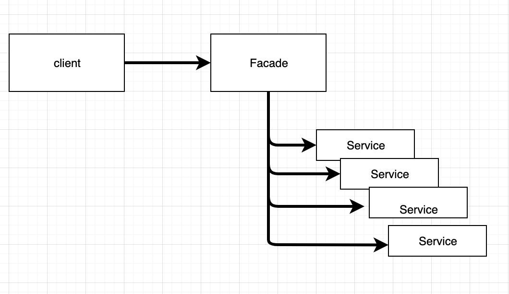
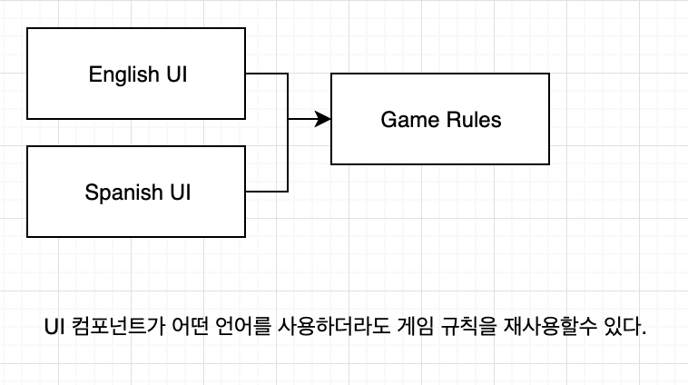
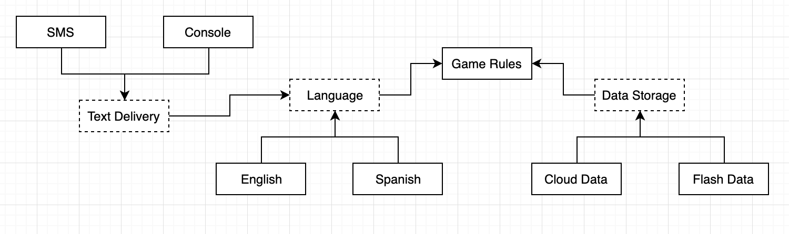
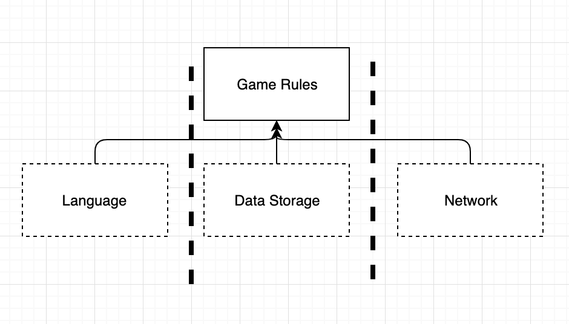
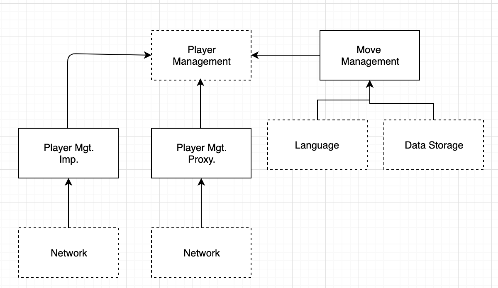

# 22장 클린아키텍처

**시스템 아키텍처와 관련된 여러가지 아이디어**

* 육각형 아키텍처 (Hexagonal Architecture)
* DCI(Data Context and Interaction)
* BCE (Boundary-Control-Entity)

**위 아키텍처의 목표?**

- 관심사의 분리
  - 소프트웨어를 계층으로 분리함으로써 관심사의 분리 목표를 달성
  - 최소한 업무 규칙을 위한 계층과, 사용자와 시스템인터페이스를 위한 또 다른 계층 하나를 포함해야한다.

**특성**

- 프레임워크 독립성
- 테스트 용이성
- UI 독립성
- 데이터베이스 독립성
- 모든 외부 에이전시에 대한 독립성

* 참고 :    [https://medium.com/@erish/python-django-clean-architecture-%EC%97%B0%EA%B5%AC%ED%95%98%EA%B8%B0-591d7a555059](https://medium.com/@erish/python-django-clean-architecture-연구하기-591d7a555059)

## 의존성 규칙

> 소스코드 의존성은 반드시 안쪽으로, 고수준의 정책을 향해야 한다.

* 내부의 원에 속한 요소는 외부의 원에 속한 어떤 것도 알지 못한다.
* 외부의 원에 선언된 데이터 형식도 내부의 원에서 절대로 사용해서는 안된다.

### 엔티티

> 전사적인 핵심 업무 규칙을 캡슐화 한것

메서드를 가지는 객체이거나 데이터 구조와 함수의 집합일수도 있다.

외부의 무엇인가가 변경되더라도 엔티티가 변경될 가능성은 적다.

특정 애플리케이션에 무언가 변경이 필요하더라도 엔티티 계층에는 절대로 영향을 주어서는 안된다.

### 유스케이스

> 애플리케이션에 특화된 업무 규칙을 포함

시스템의 모든 유스케이스를 캡슐화 하고 구현

엔티티로 들어오고 나가는 데이터 흐름을 조정

유스케이스에서 발생한 변경이 엔티티에 영향을 줘서는 안된다.

### 인터페이스 어댑터(Interface Adaptor)

일련의 어댑터들로 구성

프레젠터, 뷰, 컨트롤러는 인터페이스 어댑터 계층에 속한다.

데이터를 엔티티나 유스케이스형식에서 영속성용으로 사용중인 임의의 프레임워크(데이터베이스)가 이용하기 편리한 형식으로 변환한다.

데이터베이스에 대해 알아서는 안된다. 

### 프레임워크와 드라이버

이 계층에서는 안쪽원과 통신하기 위한 접합 코드 외에는 특별히 더 작성할 코드가 많지 않다.

모든 세부사항이 위치하는 곳

**세부사항**

* 웹
* 데이터베이스

>  세부사항을 외부에 위치시켜서 피해를 최소화해야함.

### 원은 네 개여야만 하나?

위 네개의 원은 개념을 설명하기 위한 예시일뿐 더 많은 원이 필요할 수 있다. 

하지만 `의존성 규칙` 은 적용되어야한다. 

* 소스코드 의존성은 항상 안쪽을 향한다.

* 안족으로 이동할수록 추상화와 정책의 수준은 높아진다. 

* 가장 바깥쪽 원은 저수준의 구체적인 세부사항으로 구성된다.

> 안쪽으로 이동할수록 소프트웨어는 점점 추상화되고 더 높은 수준의 정책들을 캡슐화한다.

**가장 안쪽 원**

가장 범용적이며 높은 수준을 가진다.

### 경계 횡단하기

컨트롤러와 프레젠터가 다음 계층에 속한 유스케이스와 통신하는 예제

**제어 흐름**

컨트롤러 -> 유스케이스 -> 프레젠터

**의존성**

- 컨트롤러 -> 유스케이스

- 프레젠터 -> 유스케이스

**의존성 역전원칙**

제어흐름과 의존성의 방향이 반대여야하나는 경우

**아키텍처 경계횡단시**

동적 다형성을 이용하여 소스 코드 의존성을 제어흐름과는 반대로 만들수 있고, 이를 통해 제어흐름이 어느 방향으로 흐르더라도 의존성 규칙을 준수할 수 있다.

### 경계를 횡단하는 데이터는 어떤 모습인가?

* 기본적인 구조체
* 데이터 전송 객체(Data Transfer Object)
* 간단한 인자
* 해시맵

**중요한 점**

격리되어 있는 데이터 구조가 경계를 가로질러 전달된다는 점

경계를 가로질러 데이터를 전달할 때, 데이터는 항상 내부의 원에서 사용하기에 가장 편리한 형태를 가져야한다.

## 전형적인 시나리오

## 결론

소프트웨어를 계층으로 분리하고 의존성 규칙을 준수한다면 본질적으로 테스트하기 쉬운 시스템을 만들게 될 것이며, 그에 따른 이점을 누릴 수 있다. 데이터베이스나 웹 프레임워크와 같은 시스템의 외부 요소가 구식이 되더라도, 이들 요소를 야단스럽지 않게 교체할수 있다.

# 23장 프레전터와 험블 객체

## 험블객체 패턴

> 테스트 하기 어려운 행위와 테스트하기 쉬운 행위를 단위 테스트 작성자가 분리하기 쉽게 하는 방법

**험블 객체 패턴** 

1. 행위들을 두 개의 모듈로 분리.

2. 둘 중 하나가 험블이다. 
3. 가장 기본적인 본질은 남기고 테스트하기 어려운 행위를 모두 험블 객체로 옮긴다.

## 프레젠터와 뷰

**뷰**

> 험블 객체이고 테스트하기 어렵다.

**프레젠터**

>  애플리케이션으로부터 데이터를 받아 화면에 표시할 수 있는 포맷으로 만드는 것 

## 테스트와 아키텍처

테스트 용이성은 좋은 아키텍처가 지녀야 할 속성.

험블 객체 패턴이 좋은 예

행위를 테스트하기 쉬운 부분과 테스트하기 어려운 부분으로 분리하면 아키텍처 경계가 정의되기 때문이다.

프레젠터와 뷰 사이의 경계가 이러한 경계중 하나이다. 

## 데이터베이스 게이트웨이

유스케이스 계층과 데ㅣ터베이스 사이에 데이터 베이스 게이트웨이가 존재.

데이터베이스 게이트웨이트

* 다형적 인터페이스
* 애플리케이션이 데이터 베이스에 수행하는 생성, 조회, 갱신, 삭제 작업과 관련된 모든 메서드를 포함.

데이터베이스 게이트웨이 인터페이스 구현체 는 데이터베이스 계층에 위치하고 이 구현체는 험블객체이다.

## 데이터 매퍼

객체 관계매퍼는 존재하지 않는다.

객체는 단순히 오퍼레이션의 집합이다.

ORM 보다는 데이터 매퍼라 부른게 맞다.

ORM은 게이트웨이 인터페이스와 데이터베이스 사이에서 일종의 험블 객체 경계를 형성한다.

## 서비스 리스너

서비스 리스너는 서비스 인터페이스로부터 데이터를 수신하고, 데이터를 애플리케이션에서 사용할수 있게 간단한 데이터 구조로 포맷을 변경한다. 그 후 데이터 구조는 서비스 경계를 가로질러서 내부로 전달된다.

## 결론

각 아키텍처 경계마다 경계 가까이 있는 험블 객체 패턴을 발견할수 있었다.

* 프레젠터
* 데이터베이스 게이트웨이 인터페이스 구현체
* ORM

아키텍처 경계에서 험블 객체 패턴을 사용하면 전체 시스템의 테스트 용이성을 크게 높일수 있다.

# 24장 부분적 경계

**YAGNI** (You Aren't Going to Need It)

> 너는 그게 필요하지 않아!  ->> "필요한 작업만 해라"

##부분적 경계

### 마지막 단계를 건너뛰기

독립적으로 컴파일하고 배포할 수 있는 컴포넌트를 만들기 위한 작업은 모두 수행 후, 단일 컴포넌트로 모아만 두는 것.

**장점**

* 다수의 컴포넌트를 관리하는 작업이 필요없다.
* 버전 번호도 필요없다.
* 배포 관리 부담도 없다.

**단점**

> 완벽한 경계를 만들 때 만큼의 코드량과 사전 설계가 필요하다.

### 일차원 경계

전략패턴

### 퍼사드

퍼사드 패턴

## 결론

부분적 경계 세가지 방법들은 나름의 비용과 장점을 지닌다.

각 접근법은 완벽한 형태의 경계를 담기 위한 공간으로써, 적절하게 사용할 수 있는 상황이 서로 다르다..

아키텍처 경계가 언제, 어디에 존재해야 할지 , 그리고 그 경계를 완벽하게 구현할지 아니면 부분적으로 구현할지를 결정하는 일 또한 아키텍트의 역활이다.

# 25장 계층과 경계

## 움퍼스 사냥 게임

## 클린 아키텍처?

**개선된 다이어그램**

**단순화된 다이어그램**

## 흐름 횡단하기

**흐름 횡단하기**

## 흐름 분리하기

**마이크로서비스 api 추가하기**

## 결론

아키텍처 경계는 어디에나 존재한다.

경계를 제대로 구현하려면 비용이 많이든다.

경계가 무시되고 나중에 다시 추가하려면 추가비용이 크다.

추상화가 필요하다고 미리 예측해서는 안된다. (YAGNI)

`오버 엔지니어링이 언더 엔지니어링보다 나쁠때가 훨씬 많다.`

**목표**

경계의 구현 비용이 그걸 무시해서 생기는 비용보다 적어지는 바로 그 변곡점에서 경계를 구현하는 것