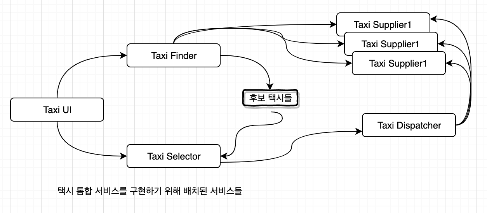
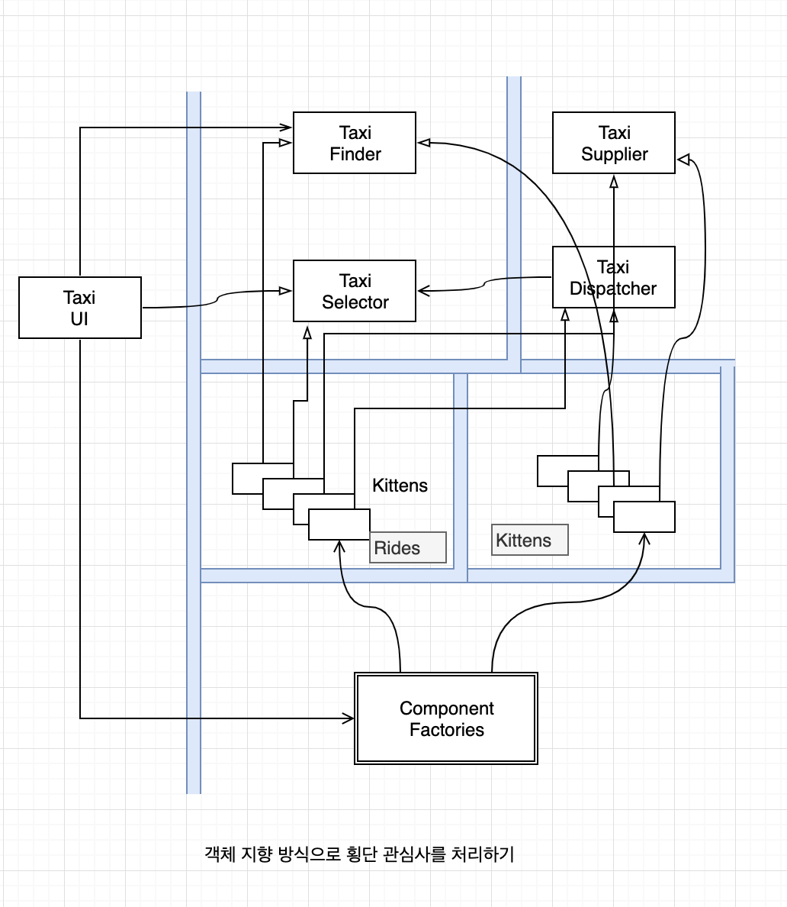
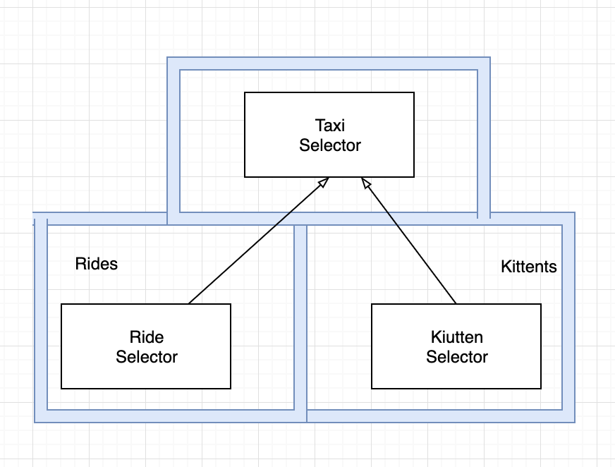

# 26 메인 컴포넌트

## 궁극전인 세부사항

**문자열 초기화**

```java
public class Mian implements HtwMessageReceiver {
	private static HuntTheWumpus game;
  private static int hitPoints = 10;
  private static final List<String> caverns = new ArrayList<>();
  private static final String[] environments = new String[] {"bright", "humid", "dry", "creepy", "ugly", "foggy", "hot", "cold", "drafty", "dreadful"};
  private static final String[] shapes = new String[] {"round", "square", "oval", "irregualar", "long", "craggy", "rough", "tall", "narrow"};
  private static final String[] cavernTypes = new String[] {"cavern", "room", "chamber". "catacomb", "crevasse", "cell", "tunnel", "passageway", "hall", "expanse"};
  private static final String[] adornments = new String[] {"smelling of sulfur", "with engravings on the walls", "", "littered with garbage" ... };
}
```


**Factory를 사용하여 게임을 생성 **

```java
public static void main() { 
	game = HtwFactory.makeGame("htw.game.HuntTheWumpusFacade", new Main()); //factory 로 main 생성
  
  createMap(); //지도 생성
  
  while(true){
    
    HuntTheWumps.Command c = game.makeRestCommand(); 
    
    /**
    	동서남북 등 키 를 받아스  행위 맵핑
    **/
    c.execute(); // 실행
  }
  
}
```


 **맵 생성**

```java
private static void createMap(){
 	int nCaverns = (int) (Math.random() * 30.0 + 10.0);
  while(nCaverns-- > 0){
    caverns.add(makeName());
  }
  
  ....
    
  game.addPitCavern(...);
  game.setQuiver(5);
}
```


**메인은 클린 아키텍처의 가장 바깥 원이다.**


## 결론

메인을 플러그인 컴포넌트로 여기고 , 아키텍처 경계 바깥에 위치하나다고 보면 설정 관련 문제를 쉽게 해결 할 수 있다.

# 27 '크고 작은 모든' 서비스들

## 서비스 아키텍처?

서비스는?

> 프로세스나 플랫폼 경계를 가로지르는 함수 호출에 지나지 않는다.

서비스를 사용하는 것이 아키텍처인가?

* 아키텍처는 의존성 규칙을 준수하며 고수준의 정채을 저수준의 세부사항으로부터 분리하는 경계에 의해 정의된다.

행위를 분리할 뿐인 서비스라면 값비싼 함수호출에 불과하며, 아키텍처관점에서 중요하다고 볼수 없다.


## 서비스의 이점?

**시스템을 서비스로 분리함으로 얻게되는 이점**

1. 서비스 사이의 결합이 확실히 분리된다.
2. 전담팀이 서비스를 소유하고 운영한다.

### 결합 분리의 오류

>  서비스 사이의 결합이 분리된다는 점

**정말일까?**

서비스 사이를 오가는 데이터 레코드에 새로운 필드를 추가한다면, 이 서비스를 사용하는 모든 서비스는 반드시 변경되어야한다.

서비스들은 이 데이터 레코드에 강하게 결합되고, 서비스들 사이는 서로 간접적으로 결합되어 버린다.


### 개발 및 배포 독립성의 오류

> 전담팀이 서비스를 소유하고 운영한다?

전담팀이 각 서비스를 작성하고, 유지보수하며, 운영하는 책임을 진다.

개발 및 배포 독립성은 확장 가능한것으로 간주돈다.

* 대규모 엔터프라이즈 시스템은 서비스 기반 시스템 이외에도, 모노리틱 시스템이나 컴포넌트 기반 시스템으로도 구축할 수 있다는 사실이다.
* 서비스라고 항상 독립적으로 개발 하고, 배포하며, 운영할수 있는 것은 아니다. 데이터나 행위에서 어느정도 결합되어 있다면 결합정도에 맞게 , 개발, 배포, 운영을 조정해야한다.

## 야옹이 문제



Micro service

* Taxi UI : 고객 서비스 담당
* Taxi Finder : TaxiSupplier의 현황을 검토하여 사용자에게 적합한 택시 후보들을 선별
* TaxiSelector : 사용자가 지정한 비용, 시간, 고급 여부 등의 조건을 기초로 후보 택시중 적합한 택시를 선택
* TaxiDisplatcher : 해당 택시에 배차 지시


고양이를 배달해달라니 !!!

고양이를 배달하려면 위 서비스들 다 변경해야한다.

횡단 관심사가 지닌 문제다.


## 객체가 구출하다

다형적으로 확장할 수 있는 클래스 집합을 생성해 새로운 기능을 처리하도록 함.


* 배차에 특화된 로직은 Rides
* 야옹이에 대한 신규 기능은 Kittens

위 두 컴포넌트는 기존 컴포넌트들에 있는 추상 기반 클래스를 템플릿 메소드나 전략 패턴등을 이용해서 오버라이드한다.

Rides 와 Kittens 가 의존성 규칙을 준수한다는 점을 주목하자.




## 컴포넌트 기반 서비스

**자바의 경우**

서비스를 하나이상의 jar 파일에 포함되는 추상 클래스들의 집합이라고 보면,  

1. 새로운 기능 추가 혹은 기능 확장은 새로운 jar 파일로 만든다. 
2. 이때 새로운 jar 파일을 구성하는 클래스들은 기존 jar 파일에 정의된 추상 클래스들을 확장해서 만들어진다. 
3. 그러면 새로운 기능 배포는 서비스를 재배포하는 문제가 아니라, 서비스를 로드하는 경로에 새로운 jar 파일만 추가하면 된다.
4. 새로운 기능 추가는 개방 폐쇄 원칙을 준수하게 된다.


## 횡단 관심사

아키텍처 경계가 서비스 사이에 있지 않다는 사실.

서비스를 관통하며 , 서비스를 컴포넌트 단위로 분할한다.

모든 시스템이 직면하는 횡단관심사를 처리하려면 


**서비스 내부는 의존성 규칙도 준수하는 컴포넌트 아키텍처로 설계해야 한다.**



## 결론

서비스는 시스템의 확장성과 개발 가능성 측면에서 유용하지만, 그 자체로는 아키텍처적으로 그리 중요한 요소는 아니다.

시스템의 아키텍처는 시스템 내부에 그어진 경계와 경계를 넘나드는 의존성에 의해 정의된다.

서비스는 단 하나의 아키텍처 경계로 둘러싸인 단일 컴포넌트로 만들수있다.

서비스는 여러 아키텍처 경계로 분리된 다수의 컴포넌트로 구성할 수 있다.

서비스는 클라이언트와 서비스가 강하게 결합되어 아키텍처적으로 아무런 의미가 없을때도 있다.


# 28. 테스트 경계

## 시스템 컴포넌트의 테스트

* 인수테스트
* 기능테스트
* cucumber 테스트
  * https://velog.io/@clarekang/cucumber-kr-login
* TDD 테스트 (Test Driven Development)
* BDD 테스트 (Behavior-Driven Development)
  * https://blog.aliencube.org/ko/2014/04/02/differences-between-bdd-and-tdd/
* 컴포넌트 테스트

**Test ?**

* 의존성 규칙을 따른다.
* 세부적이며 구체적인 것으로 의존성은 항상 테스트 대상이 되는 코드를 향한다.
* 아키텍처에서 가장 바깥쪽 원이다.
* 테스트는 독립적으로 배포가능하다.
* 시스템 컴포넌트 중 가장 고립되어있다.


## 테스트를 고려한 설계

테스트가 지닌 고립성이 테스트는 대체로 배포하지 않는 다는 사실과 어우러지며, 테스트가 시스템의 설계 범위 밖에 있다고 여겨지나 이 관점은 치명적인 오류가 있다.

테스트와 시스템이 잘 통합되지 않으면 

* 테스트는 깨지기 쉽다.
* 시스템은 뻣뻣해져 변경하기 어려워진다.

**결합**

시스템에 강력한 결합된 테스트가 변경

* 시스템 공통 컴포넌트가 변경되면 수백, 수천개의 테스트가 망가진다.
* 깨지기 쉬운 테스트 문제(Fragile Tests Problem)


**문제 해결 방법**

테스트를 고려해서 설계해야함.

* 변동성이 있는 것에 의존하지 말라. GUI 는 변동성이 크다.
* GUI를 사용하지 않고 업무 규칙을 테스트 할 수 있게 해야한다.


## 테스트 API

테스트가 모든 업무 규칙을 검증하는데 사용할 수 있도록 특화된 API 를 만들면 된다. 

이러한 API 는 보안 제약사항을 무시할 수 있고, 값비싼 자원은 건너뛰고, 시스템을 테스트 가능한 특정 상태로 갖에하는 강력한 힘들 지녀야만 한다. 이 API는 사용자 인터페이스가 사용하는 인터렉터 와 인터페이스 어댑터들의 상위 집합이 될 것이다,

테스트 API 는 테스트를 애플리케이션으로부터 분리할 목적으로 사용한다.

단순히 테스트를 UI에서 분리하는 것이 아닌, 애플리케이션 구조로부터 결합을 분리하는게 목표다.

**구조적 결합**

>  테스트 결합 중 가장 강하며, 가장 은밀하게 퍼져 나가는 유형


**보안**

>  테스트 api 를 운영에 배포하면 위험에 처할 수 있다. 

위험을 피하기 위해 테스트 API 자체와 테스트 API 중 위험한 부분의 구현부는 독립적으로 배포할수 있는 컴포넌트로 분리해야한다.

## 결론

>  테스트는 시스템 외부에 있지 않고 시스템의 일부이다.

테스트를 시스템의 일부로 설계하지 않으면 테스트는 깨지기 쉽고 유지보수하기 어려워지는 경향이 있다.

이러한 테스트는 유지보수하기 어렵기에 결국 버려지게 된다.


