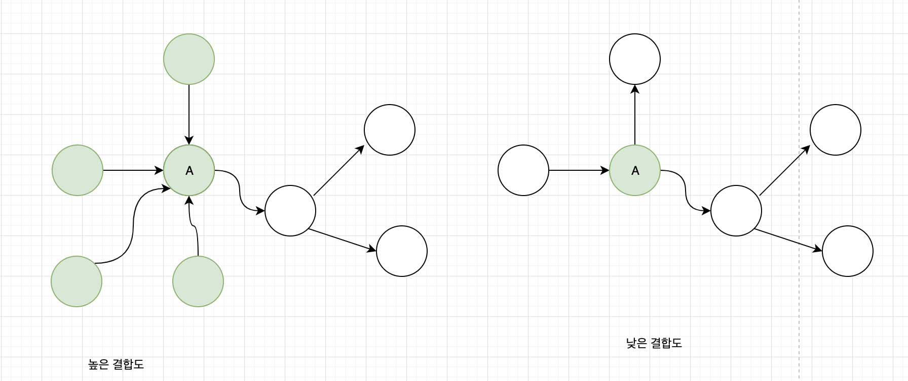
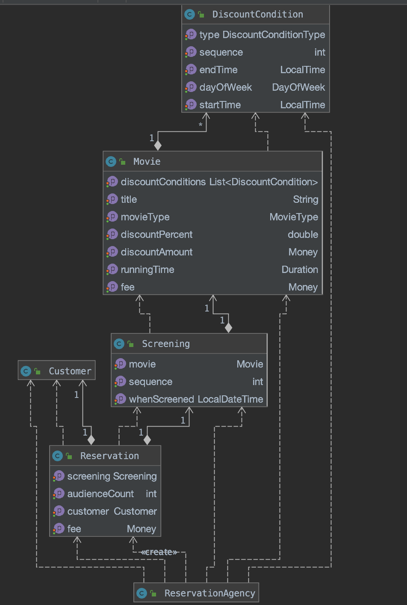
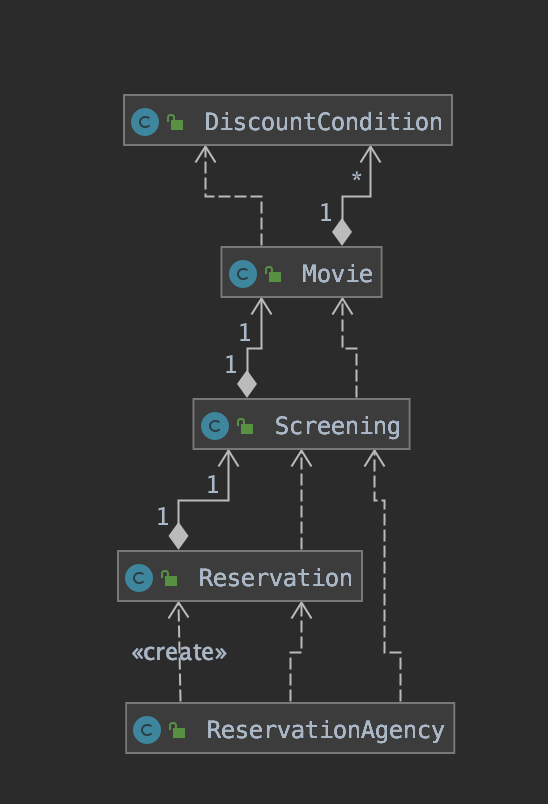

# chapter 04. 설계 품질과 트레이드오프


> 객체지향 설계란 올바른 객체에게 올바른 책임을 할당하면서 낮은 결합도와 높은 응집도를 가진 구조를 창조하는 활동이다.

1. 객체지향 설계의 핵심은 책임
2. 책임을 할당하는 작업이 응집도와 결합도 같은 설계 품질과 깊이 연계되어있다. 


## 01 . 데이터 중심의 영화 예매 시스템

**객체지향 설계의 시스템을 객체로 분할하는 두가지 방법**

1. 상태를 분할의 중심축으로 
2. 책임을 분할의 중심축으로

`상태` =`데이터`

### 데이터를 준비하자

```java
public class Movie {
    private String title;
    private Duration runningTime;
    private Money fee;
    private List<DiscountCondition> discountConditions;

    private MovieType movieType;
    private Money discountAmount;
    private double discountPercent;
}


public enum MovieType {
    AMOUNT_DISCOUNT, //금액 할인 정책
    PERCENT_DISCOUNT, //비율 할인 정책
    NONE_DISCOUNT // 미적용
}


```


객체지향의 가장 중요한 원칙인 캡슐화를 위해 Movie 클래스에  **접근자(accessor)**와 **수정자(mutator)**를 추가. 

```java
 public String getTitle() {
        return title;
    }

    public void setTitle(String title) {
        this.title = title;
    }

    public Duration getRunningTime() {
        return runningTime;
    }

    public void setRunningTime(Duration runningTime) {
        this.runningTime = runningTime;
    }

    public Money getFee() {
        return fee;
    }
```


소스코드는 아래 링크에 추가해놓았으니 확인 바랍니다.

https://github.com/dsChoi/study/tree/master/src/main/java/com/setin/study/objects/chapter04

**영화 예매 시스템 구현을 위한 데이터 클래스**


### 영화를 예매하자


```java

public class ReservationAgency {

    public Reservation reserve(Screening screening, Customer customer, int audienceCount) {
        Movie movie = screening.getMovie();
        boolean discountable = false;


        for (DiscountCondition condition : movie.getDiscountConditions()) {
            if (condition.getType() == DiscountConditionType.PERIOD) {
                discountable = screening.getWhenScreened().getDayOfWeek().equals(condition.getDayOfWeek())
                        && condition.getStartTime().compareTo(screening.getWhenScreened().toLocalTime()) <= 0
                        && condition.getEndTime().compareTo(screening.getWhenScreened().toLocalTime()) <= 0;

            } else {
                discountable = condition.getSequence() == screening.getSequence();
            }

            if (discountable) {
                break;
            }
        }

        Money fee;
        if (discountable) {
            Money discountAmount = Money.ZERO;
            switch (movie.getMovieType()) {
                case AMOUNT_DISCOUNT:
                    discountAmount = movie.getDiscountAmount();
                    break;
                case PERCENT_DISCOUNT:
                    discountAmount = movie.getFee().times(movie.getDiscountPercent());
                    break;

                case NONE_DISCOUNT:
                    discountAmount = Money.ZERO;
                    break;
            }
            fee = movie.getFee().minus(discountAmount).times(audienceCount);
        } else {
            fee = movie.getFee();
        }

        return new Reservation(customer, screening, fee, audienceCount);

    }
}
```


## 02. 설계 트레이드오프

### 캡슐화

* 외부에서 알 필요가 없는 부분을 감춤으로써 대상을 단순화 하는 추상화의 한 종류
* 객체지향 설계의 가장 중요한 원리는 불안정한 구현 세부사항을 안정적인 인터페이스 뒤로 캡슐화 하는 것

>복잡성을 다루기 위한 가장 효과적인 도구는 추상화다. 다양한 추상화 유형을 사용할 수 있지만 객체지향 프로그래밍에서 복잡성을 취급하는 주요한 추상화 방법은 캡슐화다. 그러나 객체지향 언어를 사용한다해서 잘 캡슐화 된다는 보장은 없다. 
객체지향 프로그래밍을 통해 전반적으로 얻을 수 있는 장점은 오직 설계 과정 동안 캡슐화를 목표로 인식할때만 달성될 수 있다.


### 응집도와 결합도

**응집도**

모듈에 포함된 내부 요소들이 연관되어 있는 정도

**결합도**

의존성의 정도를 나타내며 다른 모듈에 대해 얼마나 많은 지식을 갖고 있는지를 나타내는 척도


높은 응집도와 낮은 결합도를 가진 설계를 추구해야하는 이유는  그것이 **설계를 변경하기 쉽게 만들기 때문.**

응집도가 높은 설계에서는 하나의 요구사항을 변경하기 위해 하나의 모듈만 수정하면된다.

응집도가 낮은 설계에서는 하나의 요구사항을 변경하기 위해 여러 모듈을 동시에 수정해야한다.


결합도는 **한 모듈이 변경되기 위해서 다른 모듈의 변경을 요구하는 정도** 





## 03. 데이터 중심의 영화 예매 시스템의 문제점


데이터 중심의 설계가 가진 대표적인 문제점

* 캡슐화 위반
* 높은 결합도
* 낮은 응집도

### 캡슐화 위반


앨런 홀럽 : 접근자와 수정자에 과도하게 의존하는 설계 방식을 추측에 의한 설계 전략이라 부른다. 

get, set 메소드로 인해 movie 가 Money타입을 가지는 fee라는 인스턴스 변수가 존재하는 것을 인터페이스에서 노출.


```java
public class Movie {
  private Money fee;
public Money getFee() {
        return fee;
    }

    public void setFee(Money fee) {
        this.fee = fee;
    }
}

```


### 높은 결합도

```java
public class ReservationAgency {

    public Reservation reserve(Screening screening, Customer customer, int audienceCount) {
        ...
        Money fee;
        if (discountable) {
        ...
            fee = movie.getFee().minus(discountAmount).times(audienceCount);
        } else {
            fee = movie.getFee();
        }
				...
    }
}

```


**너무 많은 대상에 의존하기에 변경에 취약한 ReservationAgency**




### 낮은 응집도

ReservationAgency 에  다음과 같은 수정사항이 발생할 경우 코드를 수정해야할 것

* 할인 정책이 추가될 경우
* 할인 정책별로 할인 요금을 계산하는 방법이 변경될 경우
* 할인 조건이 추가되는 경우
* 할인 조건별로 할인 여부를 판단하는 방법이 변경될 경우
* 예매 요금을 계산하는 방법이 변경될 경우


**낮은 응집도는 두가지 측면에서 설계에 문제를 일으킨다.**

* 변경의 이유가 서로 다른 코드들을 하나의 모듈 안에 뭉쳐 놓았기 때문에 변경과 아무 상관이 없는 코드들이 영향을 받는다.
* 하나의 요구사항 변경을 반영하기 위해 동시에 여러 모듈을 수정해야 한다. 응집도가 낮을 경우 다른 모듈에 위치해야 할 책임의 일부가 엉뚱한 곳에 위치하기 때문이다. 


**단일 책임 원칙(Single Responsibility Principle, SRP)**

> 로버트 마틴 , 클래스는 단 한가지의 변경 이유만 가져야 한다는 것이다. 


## 04. 자율적인 객체를 향해

### 캡슐화를 지켜라

```java
class AnyClass{
  void any(Rectangle rectangle, int muliple){
    rectangle.setRight(rectangle.getRight() * multiple);
    rectangle.setBottom(rectangle.getBottom() * multiple);
  }
}
```


```java
class Rectangle{
  public void enlarge(int multiple){
    right *= muliple;
    bottom *= multiple;
  }
}
```


### 스스로 자신의 데이터를 책임지는 객체

```java
@Data
public class DiscountCondition {
    private DiscountConditionType type;

    private int sequence;
    private DayOfWeek dayOfWeek;
    private LocalTime startTime;
    private LocalTime endTime;
}
```


```java

public class DiscountCondition {
...
    public boolean isDiscountable(DayOfWeek dayOfWeek, LocalTime time ) {
        if(type != DiscountConditionType.PERIOD){
            throw new IllegalArgumentException();
        }
        return this.dayOfWeek.equals(dayOfWeek) &&
                this.startTime.compareTo(time) <=0 &&
                this.endTime.compareTo(time) >=0;
    }

    public boolean isDiscountable(int sequence){
        if(type != DiscountConditionType.SEQUENCE){
            throw  new IllegalArgumentException();
        }
        return this.sequence == sequence;
    }
}
```


```java
public class Movie{
  
    public Money calculateAmountDiscountedFee() {
        if (movieType != MovieType.AMOUNT_DISCOUNT) {
            throw new IllegalArgumentException(
            );
        }
        return fee.minus(discountAmount);
    }

    public Money calculatePercentDiscountedFee() {
        if (movieType != MovieType.PERCENT_DISCOUNT) {
            throw new IllegalArgumentException(
            );
        }
        return fee.minus(fee.times(discountPercent));
    }

    public Money calculateNoneDiscountedFee() {
        if (movieType != MovieType.NONE_DISCOUNT) {
            throw new IllegalArgumentException();
        }

        return fee;

    }


    public boolean isDiscountable(LocalDateTime whenScreend, int sequence) {
        for (DiscountCondition condition : discountConditions) {
            if (condition.getType() == DiscountConditionType.PERIOD) {
                return condition.isDiscountable(whenScreend.getDayOfWeek(), whenScreend.toLocalTime());
            } else {
                return condition.isDiscountable(sequence);
            }
        }
        return false;
    }
}
```


```java
public class ReservationAgency {
    public Reservation reserve(Screening screening, Customer customer, int audienceCount) {
        Money fee = screening.calculateFee(audienceCount);
        return new Reservation(customer, screening, fee, audienceCount);

    }
}
```


** 결합도 측면에서 이전보다 개선된 설계**




## 05. 하지만 여전히 부족하다

### 캡슐화 위반


Movie 는 아래 세개 메서드를 통해 할인 정책에는 금액, 비율, 미적용 정책이 세가지 존재한다는 것을 노출한다. 


```java
public class Movie{ 
    public Money calculateAmountDiscountedFee() {}

    public Money calculatePercentDiscountedFee() {}

    public Money calculateNoneDiscountedFee() {}
}
```


**캡슐화의 진정한 의미**

>캡슐화가 단순히 객체 내부의 데이터를 외부로부터 감추는 것 이상의 의미를  잘 보여준다. 사실 캡슐화는 변경될 수 있는 어떤 것이라도 감추는 것을 의미. 내부 속성을 외부로부터 감추는 것은 '데이터 캡슐화' 라는 캡슐화의 한 종류일 뿐. 
>
>캡슐화는 변하는 것 어떤 것이든 감추는 것이다. 그것이 무엇이든 구현과 관련된 것이라면.. 


### 높은 결합도


```java
public class Movie{
  
    public boolean isDiscountable(LocalDateTime whenScreend, int sequence) {
        for (DiscountCondition condition : discountConditions) {
            if (condition.getType() == DiscountConditionType.PERIOD) {
                return condition.isDiscountable(whenScreend.getDayOfWeek(), whenScreend.toLocalTime());
            } else {
                return condition.isDiscountable(sequence);
            }
        }
        return false;
    }

}
```

* DiscountCondition의 기간 할인 조건의 명칭이 PERIOD에서 다른 값을 변경되면 Movie를 수정해야한다.

* DiscountCondition의 종류가 추가되거나 삭제되면 if-else 구문을 수정해야한다.

* DiscountCondition의 만족여부를 판단하는데 필요한 정보가 변경되면 Movie의 `isDiscountable` 메서드로 전달되는 파라미터를 변겨앻야한다. 

  

### 낮은 응집도


```java
public class Screening{
  public Money calculateFee(int audienceCount) {
        switch (movie.getMovieType()) {
            case AMOUNT_DISCOUNT:
                if (movie.isDiscountable(whenScreened, sequence)) {
                    return movie.calculateAmountDiscountedFee().times(audienceCount);
                }
                break;
            case PERCENT_DISCOUNT:
                if (movie.isDiscountable(whenScreened, sequence)) {
                    return movie.calculatePercentDiscountedFee().times(audienceCount);
                }
                break;

            case NONE_DISCOUNT:
                return movie.calculateNoneDiscountedFee().times(audienceCount);
        }
        return movie.calculateNoneDiscountedFee().times(audienceCount);
        
    }
}
```

할인 조건을 변경하려면 DiscountCondition, Movie, Screening을 함께 수정해야한다. 


## 06. 데이터 중심 설계의 문제점

데이터 중심의 설계가 변경에 취약한 이유

1. 데이터 중심의 설계는 본질적으로 너무 이른 시기에 데이터에 관해 결정하도록 한다.
2. 데이터 중심의 설계에서는 협력이라는 문맥을 고려하지 않고 객체를 고립시킨 채 오퍼레이션을 결정한다. 


### 데이터 중심 설계는 객체의 행동보다는 상태에 초점을 맞춘다.

**데이터는 구현의 일부라는 사실을 명심하라. **

* 데이터 중심설계에서 객체는 단순 데이터의 집합체일 뿐이다. 

너무 이른 시기에 데이터에 대해 고민하기 때문에 캡슐화에 실패하게 된다. 객체의 내부 구현이 객체의 인터페이스를 어지럽히고 객체의 응집도와 결합도에 나쁜 영향을 미치기 때문에 변경에 취약한 코드를 낳게 된다. 

### 데이터 중심 설계는 객체를 고립시킨 채 오퍼레이션을 정의하도록 만든다.

객체지향 설계의 무게 중심은 내부 객체가 아닌 외부에 맞춰져 있어야한다.  중요한 점은 객체가 다른 객체와 협력하는 방법이다. 

데이터 중심 설계의 초점은 객체의 내부가 아닌 내부에 있다. 실행 문맥에 대한 깊이 있는 고민 없이 객체가 관리할 데이터의 세부 정보를 먼저 결정한다.

객체의 인터페이스에 구현이 노출돼 있었기 때문에 협력이 구현 세부사항에 종속돼 있고 그에 따라 객체의 내부 구현이 변경될때 협력하는 객체 모두가 영향을 받을수 밖에 없었던 것이다.


