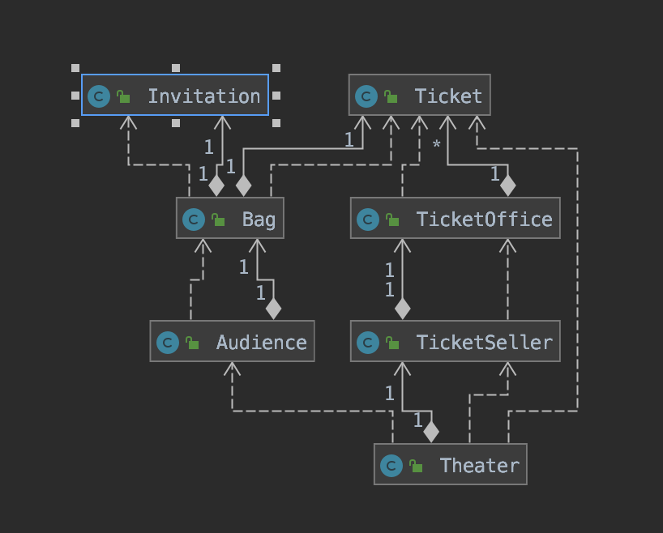
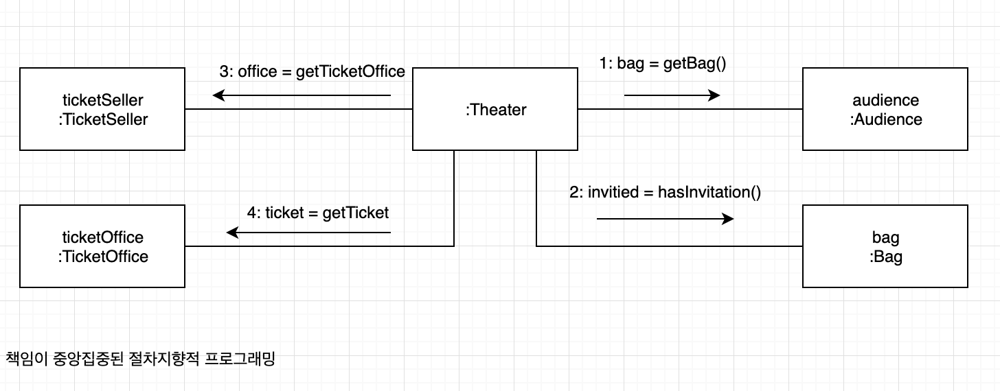
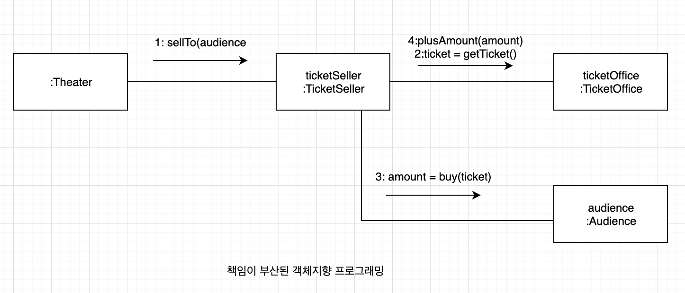

# chapter 01. 객체 , 설계

## 티켓 판매 애플리케이션 구현하기



애플리케이션의 핵심 클래스


## 무엇이 문제인가

로버트 마틴은 클린 소프트웨어에서 소프트웨어 모듈이 가져야 하는 세가지 기능에 관해 설명한다. 

>모든 소프트웨어 모듈에는 세 가지의 목적이 있다. 첫번째 목적은 실행 중에 제대로 동작하는 것이다. 이것은 모듈의 존재 이유. 두번째 목적은 변경을 위해 존재하는 것이다. 대부분의 모듈은 생명주기 동안 변경되기 때문에 간단한 작업만으로도 변경이 가능해야 한다. 변경하기 어려운 모듈은 제대로 동작하더라도 개선해야한다. 모듈의 세번째 목적은 코드를 읽는 사람과 의사소통하는 것이다. 모듈은 특별한 훈련 없이도 개발자가 쉽게 읽고 이해할 수 있어야 한다. 읽는 사람과 의사소통할 수 없는 모듈은 개선해야한다.


모듈은 제대로 실행되어야 하고, 변경이 용이해야 하며, 이해하기 쉬워야 한다. 

하지만 앞서 작성한 프로그래밍은 변경 용이성과 읽는 사람과의 의사소통이라는 목적은 만족시키지 못한다.


### 예상을 빗나가는 코드

### 변경에 취약한 코드


**너무 많은 클래스에 의존하는 Theater**


객체사이의 **의존성(dependency)** 문제 .

객체 사이의 의존성이 과한 경우를 가리켜 **결합도(coupling)**가 높다고 말한다. 

두 객체 사이의 결합도가 높으면 높을수록 함께 변경될 확률도 높아지기 때문에 변경하기 어려워진다. 

따라서 설계의 목표는 객체 사이의 결합도를 낮춰 변경이 용이한 설계를 만드는 것이다.


## 설계 개선하기

### 자율성을 높이자.

Theater가 Audience 와 TicketSeller 뿐만 아니라 Audience 소유의 Bag과 TicketSeller 가 근무하는 TicketOffice까지 접근이 가능하기에 설계를 변경하기 어렵다.

해결 방법은 Audience 와 TicketSeller 가 직접 Bag 과 TicketOffice를 처리하는 자율적인 존재가 되도록 설계를 변경.


**변경전** 

```java
public class Theater {
	private TicketSeller ticketSeller;

	public Theater(TicketSeller ticketSeller) {
		this.ticketSeller = ticketSeller;
	}

	public void enter(Audience audience) {
		if (audience.getBag().hasInvitation()) {
			Ticket ticket = ticketSeller.getTicketOffice().getTicket();
			audience.getBag().setTicket(ticket);
		} else {
			Ticket ticket =ticketSeller.getTicketOffice().getTicket();
			audience.getBag().minusAmount(ticket.getFee());
			ticketSeller.getTicketOffice().plusAmount(ticket.getFee());
			audience.getBag().setTicket(ticket);
		}
	}
}
```

**변경후**

```java
public class Theater {
	private TicketSeller ticketSeller;

	public Theater(TicketSeller ticketSeller) {
		this.ticketSeller = ticketSeller;
	}

	public void enter(Audience audience) {
		ticketSeller.sellTo(audience);
	}
}

```


**Theater의 결합도를 낮춘 설계**


### 무엇이 개선됐는가?

Audience 와 TicketSeller는 자신이 가지고 있는 소지품을 스스로 관리한다. 

Audience 와 TicketSeller의 내부구현을 변경하더라도 Theater를 함께 변경할 필요가 없어졌다. 


### 어떻게 한 것인가?

판매자가 티켓을 판매하기 위해 TiketOffice를 사용하는 모든 부분을 TicketSeller로 옮기고, 관람객이 티켓을 구매하기 위해 Bag을 사용하는 부분을Audice 내부로 옮겼다. 

자기 자신의 문제를 스스로 해결하도록 코드를 변경한 것. 

1. 변환전 


2. 변환 후 


### 캡슐화와 응집도

핵심!

객체 내부의 상태를 캡슐화하고 객체 간의 메시지를 통해서만 상호작용하도록 만드는 것.

밀접하게 연관된 작업만을 수행하고 연관성 없는 작업은 다른 객체에게 위임하는 객체를 가리켜 **응집도(cohesion)** 가 높다고 할수 있다.  자신의 데이터를 스스로 처리하는 자율적인 객체를 만들면 결합도를 낮출수 있을뿐더러 응집도를 높을수 있다.


### 절차지향과 객체지향

**절차지향 프로그래밍**

> 프로세스와 데이터를 별도의 모듈에 위치시키는 방식


**객체지향 프로그래밍(Object-Oriented Programming)**

> 데이터와 프로세스가 동일한 모듈 내부에 위치하도록 프로그래밍하는 방식


**훌륭한 객체지향 설계의 핵심**

> 캡슐화를 이용해 의존성을 적절히 관리함으로써 객체 사이의 결합도를 낮추는 것.


### 책임의 이동

절차지향과 객체지향의 차이를 만드는 것은 책임의 이동(Shift of responsibility)







### 

### 더 개선할 수 있다.

변경을 하지만 TicketOffice -> Audience로 통하는 의존성이 추가되었다.


1. 변경전 코드

```java
public class TicketSeller {
	public void sellTo(Audience audience){
		ticketOffice.plusAmount(audience.buy(ticketOffice.getTicket()));
	}
}
```

2. 변경후 코드

```java
public class TicketSeller{	
  public void sellTicketTo(Audience audience){
    plusAmount(audience.buy(getTicket()));
    }
}

```


변경을 하지만 TicketOffice -> Audience로 통하는 의존성이 추가되었다.


## 객체지향 설계

### 설계가 왜 필요한가

> 설계란 코드를 배치하는 것이다.

### 객체지향 설계

변경에 유연하게 다응할 수 있는 코드.

객체지향 프로그래밍은 의존성을 효율적으로 통제할 수 있는 다양한 방법을 제공함으로써 요구사항 변경에 좀 더 수월하게 대응할 수 있는 가능성을 높여준다. 

변경 가능한 코드란 이해하기 쉬운 코드다.

훌륭한 객체지향 설계란?

협력하는 객체 사이의 의존성을 적절하게 관리하는 설계다. 세상에 엮인 것이 많은 사람일수록 변하기 어려운 것처럼 객체가 실행되는 주변 환경에 강하게 결합될수록 변경하기 어려워진다. 객체 간의 의존성은 애플리케이션을 수정하기 어렵게 만드는 주범이다.


