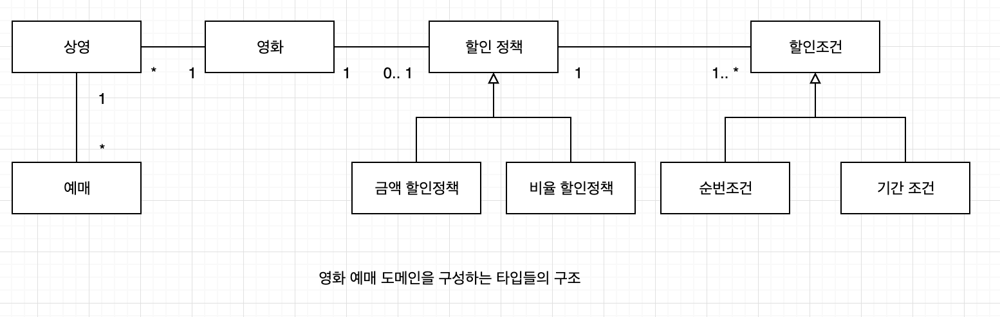
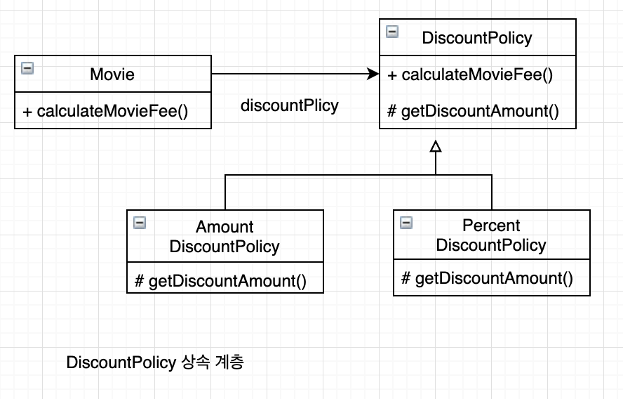
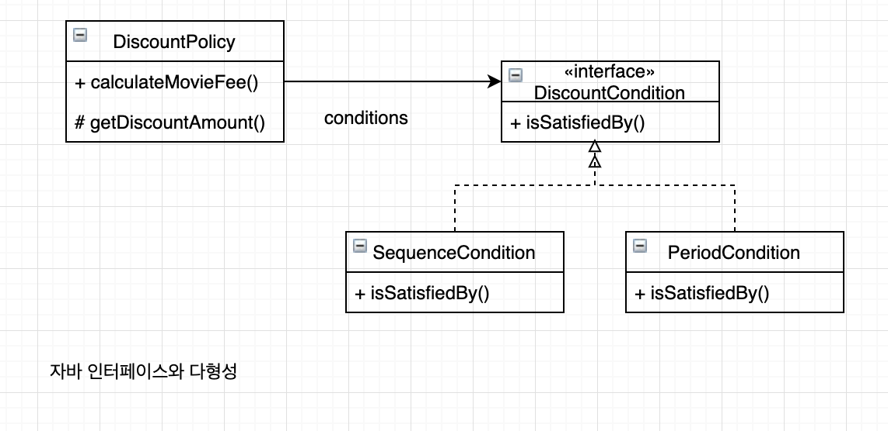

# chapter 02. 객체지향 프로그래밍


## 01. 영화 예매 시스템

### 요구사항

* 영화
* 상영
* 할인 규칙
  * 할인 조건
    * 순서 조건
    * 기간 조건
  * 할인 정책
    * 금액 할인 정책
    * 비율 할인 정책


## 02. 객체지향 프로그래밍을 향해

### 협력, 객체, 클래스

> 진정한 객체지향 패러다임으로서의 전환은 클래스가 아닌 객체에 초점을 맞출때 얻을수 있다.

1. 어떤 클래스가 필요한지를 고민하기 전에 어떤 객체들이 필요한지 고민하라. 클래스는 공통적인 상태화 행동을 공유하는 객체들을 추상화한 것이다. 
2. 객체를 독립적인 존재가 아니라 기능을 구현하기 위해 협력하는 공통체의 일원으로 봐야한다. 객체는 홀로 존재하는 것이 아니다. 다른 객체에게 도움을 주거나 의존하면서 살아가는 협력적인 존재다. 객체 지향적으로 생각하고 싶다면 객체를 고립된 존재로 바라보지 말고 협력에 참여하는 협력자로 바라봐야한다.

### 도메인의 구조를 따르는 프로그램 구조

**도메인**

> 문제를 해결하기 위해 사용자가 프로그램을 사용하는 분야





### 클래스 구현하기

```java
public class Screening {
    private Movie movie;
    private int sequence;
    private LocalDateTime localDateTime;

    public Screening(Movie movie, int sequence, LocalDateTime localDateTime) {
        this.movie = movie;
        this.sequence = sequence;
        this.localDateTime = localDateTime;
    }

    public Movie getMovie() {
        return movie;
    }

    public boolean isSequence(int sequence){
        return this.sequence == sequence;
    }

    public Money getMovieFee(){
        return movie.getFee();
    }
}
```

#### 자율적인 객체

1. 객체는 상태(state)와 행동(behivior)를 함께 가지는 복합적인 존재.
2. 객체가 스스로 판단하고 행동하는 **자율적인 존재**


**캡슐화**

데이터와 기능을 객체 내부로 함께 묶는 것

**접근 제어(access control)**

**접근 수정자 (access modifier)**


캡슐화와 접근 제어는 객체를 두부분으로 나눈다. 

1. 외부에서 접근가능한 부분 - **퍼블릭 인터페이스(public interface)**
2. 외부에서는 접근 불가능 하고 오직 내부에서만 접근 가능한 부분 - **구현(implementation)**

알아두어야 할 키워드 

**인터페이스와 구현의 분리(separation of interface and implementation) 원칙 **

#### 프로그래머의 자유

프로그래머의 역할

1. 클래스 작성자 : 새로운 데이터 타입을 프로그램에 추가.
2. 클라이언트 프로그래머 : 클래스 작성자가 추가한 데이터 타입을 사용


**구현 은닉(implementation hiding)**

클래스 작성자가 숨겨놓은 부분에 마음대로 접근할 수 없도록 방지함으로써 클라이언트 프로그래머에 대한 영향을 걱정하지 않고도 내부 구현을 마음대로 변경 가능

클래스 작성자는 인터페이스를 바꾸지 않는 한 외부에 미치는 영향을 걱정하지 않고도 내부 구현을 마음대로 변경할 수 있다. public 영역을 변경하지 않는다면 코드를 자유롭게 수정할 수 있다.


###  협력하는 객체들의 공동체

```java
public class Screening {
    private Money calculateFee(int audienceCount){   
        return movie.calculateMovieFee(this).time(audienceCount);
    }
}
```


```java
package com.setin.study.objects.chapter02;

import java.math.BigDecimal;

public class Money {
    public static final Money ZERO = Money.wons(0);

    private final BigDecimal amount;

    public Money(BigDecimal amount) {
        this.amount = amount;
    }

    public static Money wons(long amount) {
        return new Money(BigDecimal.valueOf(amount));
    }

    public static Money wons(double amount) {
        return new Money(BigDecimal.valueOf(amount));
    }

    public Money plus(Money amount) {
        return new Money(this.amount.add(amount.amount));
    }

    public Money minus(Money amount) {
        return new Money(this.amount.subtract(amount.amount));
    }

    public Money time(Money amount) {
        return new Money(this.amount.multiply(amount.amount));
    }

    public boolean isLessThan(Money other) {
        return amount.compareTo(other.amount) < 0;
    }

    public boolean isGreater(Money other) {
        return amount.compareTo(other.amount) >= 0;
    }
}

```


금액 구현을 위해 Money 타입을 생성

금액과 관련된 로직이 서로 다른곳에 중복되어 구현되는 것을 막을수 있고. 저장하는 값이 금액과 관련되어 있다는 의미를 전달해 줄수 있다. 


영화를 예매하기 위해 Screening, Movie, Reservation 인스턴스들은 서로의 메서드를 호출하며 상호 작용한다.

이처럼 시스템의 어떤 기능을 구현하기 위해 객체들 사이에 이뤄지는 상호작용을 **협력(Collaboration)** 이라 한다.


### 협력에 관한 짧은 이야기

객체는 다른 객체의 인터페이스에 공개된 행동을 수행하도록 **요청(request)**

요청을 받은 객체는 자율적인 방법에 따라 요청을 처리한 후 **응답(response)**

객체와 다른 객체와 상호 작용할 수 있는 유일한 방법은 **메세지 전송(send a message)**

다른 객체에게 요청이 도착할 때 해당 객체가 **메세지 수신(receive a message)**

메세지를 수신한 객체는 스스로의 결정에 따라 자율적으로 메세지를 처리할 방법을 결정**메서드(method)**

**다형성(polymorphism)**


## 03. 할인 요금 구하기

### 할인 요금 계산을 위한 협력 시작하기

```java

public class Movie {
    private String title;
    private Duration runningTime;
    private Money fee;
    private DiscountPolicy discountPolicy;


    public Money getFee() {
        return fee;
    }

    public Money calculateMovieFee(Screening screening) {
        return fee.minus(discountPolicy.calculateDiscountAmount(screening));
    }
}

```


Movie 는 할인 정책을 판단하는 코드가 존재하지 않고 discountPolicy에게 메세지를 전송할 뿐이다.


### 할인 정책과 할인 조건

**추상클래스**

```java

public abstract class DiscountPolicy {
    private List<DiscountCondition> conditions = new ArrayList<>();

     public DiscountPolicy(DiscountCondition ... conditions){
         this.conditions = Arrays.asList(conditions);
     }

     public Money calculateDiscountAmount(Screening screening){
         for (DiscountCondition condition : conditions) {
             if(condition.isSatisfiedBy(screening)){
                 return getDiscountAmount(screening);
             }
         }
         return Money.ZERO;
     }

     abstract protected Money getDiscountAmount(Screening screening);

}
```

**Template Method pattern**

부모클래스에 기본적인 알고리즘의 흐름을 구현하고 중간에 필요한 처리를 자식 클래스에 위임하는 디자인 패턴


```java
public interface DiscountCondition {
     boolean isSatisfiedBy(Screening screening);
}
```

```java
public class PeriodCondition implements  DiscountCondition {
    private DayOfWeek dayOfWeek;
    private LocalTime startTime;
    private LocalTime endTime;


    @Override
    public boolean isSatisfiedBy(Screening screening) {
        return screening.getStartTime().getDayOfWeek().equals(dayOfWeek) &&
                startTime.compareTo(screening.getStartTime().toLocalTime()) <= 0 &&
                endTime.compareTo(screening.getStartTime().toLocalTime()) >=0;
    }
}

public class SequenceCondition implements DiscountCondition {
    private int sequence;
    @Override
    public boolean isSatisfiedBy(Screening screening) {
        return screening.isSequence(sequence);
    }
}

```


```java
public class AmountDiscountPolicy extends DiscountPolicy {
    private Money discountAmount;

    public AmountDiscountPolicy(Money discountAmount, DiscountCondition... conditions) {
        super(conditions);
        this.discountAmount = discountAmount;
    }

    @Override
    protected Money getDiscountAmount(Screening screening) {
        return discountAmount;
    }
}

public class PercentDiscountPolicy extends DiscountPolicy {

   private double percent;

    public PercentDiscountPolicy(double percent, DiscountCondition... conditions) {
        super(conditions);
        this.percent = percent;
    }

    @Override
    protected Money getDiscountAmount(Screening screening) {
        return screening.getMovieFee().times(percent);

    }
}

```


### 할인 정책 구성하기


생성자의 파라미터 목록을 이용해 초기화에 필요한 정보를 전달하도록 강제하면 올바른 상태를 가진 객체의 생성을 보장할수 있다.


```java
Movie avatar = new Movie("아바타", Duration.ofMinute(120), Money.wons(10000), 
	new AmountDiscountPolicy(Money.wons(800), 
  new SequenceCondition(1), 
  new SequenceCondition(10), 
  new PeriodCondition(DayOfWeek.Monday, LocalTime.of(10, 0), LocalTime.of(11, 59)), 
  new PeriodCondition(DayOfWeek.THURSDAY, LocalTime.of(10, 0), LocalTime.of(20, 59)), 
)
```


## 04. 상속과 다형성

### 컴파일 시간 의존성과 실행 시간 의존성



코드의 의존성과 실행 시점의 의존성이 서로 다를수 있다.

다시 말해 클래스 사이의 의존성과 객체 사이의 의존성은 동일하지 않을 수 있다.  `유연하고 쉽게 재사용할 수 있으며, 확장 가능한 객체지향 설계가 가지는 특징은 코드의 의존성과 실행 시점의 의존성이 다르다는 것`이다.


### 차이에 의한 프로그래밍

### 상속과 인터페이스

### 다형성

> 동일한 메세지를 수신했을 때 객체의 타입에 따라 다르게 응답할 수 있는 능력을 의미
>
> 따라서... 다형적인 협력에 참여하는 객체들은 모두 같은 메시지를 이해할 수 있어야한다. -> 인터페이스가 동일해야한다.다형성을 구현하는 방법 


**구현 상속과 인터페이스 상속 **

>상속을 구현 상속과 인터페이스 상속으로 분류할 수 있다. 구현 상속을 서브클래싱이라 부르고, 인터페이스 상속을 서브타이핑이라 한다. 순수하게 코드를 재사용하기 위한 목적으로 상속을 사용하는 것을 구현 상속, 다형적인 협력을 위해 부모 클래스와 자식 클래스가 인터페이스를 공유할 수 있도록 상속을 이용하는 것을 인터페이스 상속
>
>상속은 구현 상속이 아닌 인터페이스 상속을 위해 사용해야 한다. 인터페이스를 재사용할 목적이 아니라 재사용할 목적으로 상속을 사용하면 변경에 취약한 코드를 낳게 될 것이다.


### 인터페이스와 다형성

추상클래스를 이용해 다형성을 구현했던 할인 정책과 달리 할인 조건은 구현을 공유할 필요가 없기에 인터페이스를 이용해 타입 계층을 구현했다.





## 05. 추상화와 유연성

### 추상화의 힘

### 유연한 설계

### 추상 클래스와 인터페이스 트레이드오프

### 코드 재사용

상속보다는 합성이 더 좋은 방법이라는 이야기를 많이 한다. 

합성은 다른 객체의 인스턴스를 자신의 인스턴스 변수로 포함해서 재사용하는 방법

### 상속

상속은 두가지 관점에서 설계에 안좋은 영향을 끼친다.

1. 캡슐화를 위반한다는 것
2. 설계를 유연하지 못하게 만든다는 것


### 합성

합성은 상속이 가지는 두가지 문제점을 모두 해결가능하다.

1. 인터페이스에 정의된 메시지를 통해서만 재사용이 가능하기 때문에 구현을 효과적으로 캡슐화할 수 있다.
2. 의존하는 인스턴스를 교체하는 것이 비교적 쉽기 때문에 설계를 유연하게 만든다.

상속은 클래스를 통해 강하게 결합되는 데 비해 합성은 메시지를 통해 느슨하게 결합된다. 


**코드 재사용을 위해서는 상속보다는 합성을 선호하는 것이 더 좋은 방법이다. [GOF94]**

