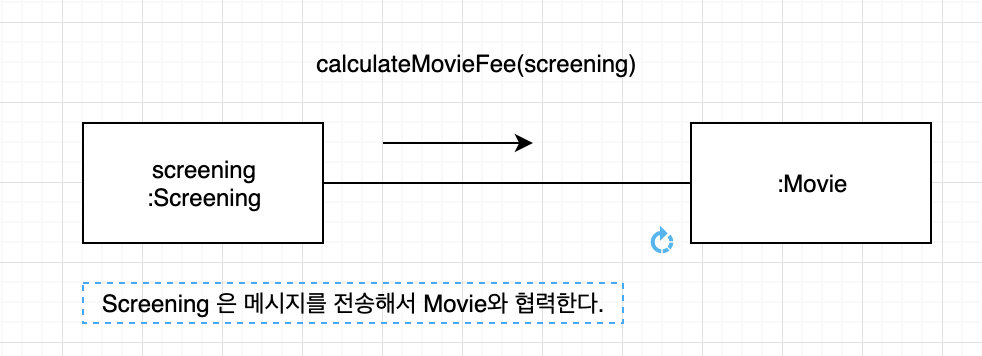
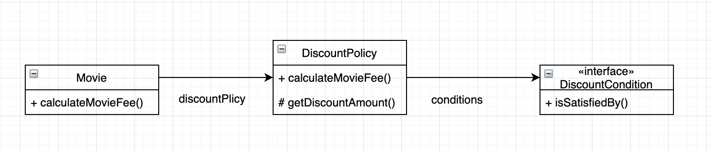

# Chapter 03. 역할, 책임, 협력

**객체지향 패러다임의 핵심**

* 역할(role)
* 책임(responsibility)
* 협력(collaboration)

**객체지향의 본질**

> 협력하는 객체들의 공동체를 창조하는 것

**객체지향 설계의 핵심**

> 협력을 구성하기 위해 적절한 객체를 찾고 적절한 책임을 할당하는 과정에서 나타난다.

## 01. 협력

### 영화 예매 시스템 돌아보기

**책임**

객체가 협력에 참여하기 위해 수행하는 로직

**역할**

객체들이 협력 안에서 수행하는 책임들이 모여 객체가 수행하는 일

**협력**

객체들이 애플리케이션의 기능을 구현하기 위해 수행하는 상호작용

### 협력

> 협력이란? 
>
> 어떤 객체가 다른 객체에게 무엇인가를 요청하는 것.
>
> 객체사이의 협력을 설계할 때는 객체를 서로 분리된 인스턴스가 아닌 협력하는 파트너로 인식해야 한다.

**메세지 전송**

객체 사이의 협력을 위해 사용할 수 있는 유일한 커뮤니케이션 수단.

객체는 다른 객체의 상세한 내부 구현에 직접 접근할 수 없기에 메시지 전송을 통해서만 자신의 요청을 전달할 수 있다.

**메서드**

메세지를 수신한 객체는 `메서드` 를 실행해 요청에 응답한다.

* 외부의 객체는 메시지만 전송할 뿐 메시지를 어떻게 처리할지는 메시지를 수신한 객체가 결정

**자율적인 객체**

자신의 상태를 직접 관리하고 스스로의 결정에 따라 행동하는 객체.

**캡슐화**

객체를 자율적으로 만드는 가장 기본적인 방법

> 자율 적인 객체는 자신에게 할당된 책임을 수행하던 중 필요한 정보를 알지 못하거나 외부의 도움이 필요한 경우 적절한 객체에게 메시지를 전송해서 협력을 요청한다. 메시지를 수신한 객체 역시 메시지를 처리하던 중 직접처리 할수 없는 경우 다른 객체에 도움을 요청한다. 이처럼 객체들 사이의 협력을 구성하는 요청과 응답의 흐름을 통해 애플리케이션의 기능이 구현된다.
> 

### 협력이 설계를 위한 문맥을 결정한다.

**객체지향**

>  객체를 중심에 놓는 프로그래밍 패러다임

* 애플리케이션에서 객체가 필요하다면 그 이유는 단 하나여야한다. 그 객체가 어떤 협력에 참여하고 있기 때문이다. 그 객체가 협력에 참여할수 있는 이유는 협력에 필요한 `적절한 행동` 을 보유하고 있기 때문이다.

**협력**

객체가 필요한 이유와 객체가 수행하는 행동의 동기를 제공

* 객체의 행동을 결정하는 것 : 협력
* 객체의 상태를 결정하는 것: 행동
* 객체가 행동하는 데 필요한 정보 : 상태
* 협력 안에서 객체가 처리할 메시지 : 행동

> 객체가 참여하는 협력이 객체를 구성하는 행동과 상태 모두를 결정한다. 
>
> 따라서. 협력은 객체를 설계하는 데 필요한 일종의 문맥(Context)를 제공한다.

## 02. 책임

### 책임이란 무엇인가?

#### 하는 것

* 객체를 생성하거나 계산을 수행하는 등의 스스로 하는 것
* 다른 객체의 행동을 시작시키는 것
* 다른 객체의 활동을 제어하고 조절하는 것

#### 아는 것

* 사적인 정보에 관해 아는 것
* 관련된 객체에 관해 아는 것
* 자신이 유도하거나 계산할 수 있는 것에 대해 아는 것

----

책임과 메시지의 크기는 다르다.

책임은 객체가 수행할 수 있는 행동을 종합적이고 간략하게 서술하기 때문에 메시지보다 추상적이고 개념적으로 크다.

"객체지향 개발에서 가장 중요한 능력은 책임을 능숙하게 소프트웨어에 할당하는 것" - 

사실상 , 협력이 중요한 이유는 객체에게 할당할 책임을 결정할 수 있는 문맥을 제공하기 때문.

### 책임 할당

**책임 할당을 위한 정보 전문가(Information Expert) 패턴**

* 자율적인 객체를 만드는 가장 기본적인 방법은 책임을 수행하는 데 필요한 정보를 가장 잘 알고 있는 전문가에게 그 책임을 할당하는 것

  

협력에 필요한 지식과 방법을 가장 잘 알고 있는 객체에게 도움을 요청한다. 

---

1. Message  : 예매하라 
2. 예매를 하기 위한 상영 시간 및 기본요금을 잘 알고 있는 전문가를 찾자 : Screening
3. 영화 예매를 하기 위해서는 예매 가격을 계산해야한다.  Message: 가격을 계산하라 , 외부 메시지 전달.
4. 가격을 계산하기 위한 할인 정책과 가격 정보를 가장 잘 알고 있는 정보 전문가를 찾자 : Movie

---

객체지향 설계는 협력에 필요한 메시지를 찾고 메시지에 적절한 객체를 선택하는 반복적인 과정을 통해 이루어 진다. 그리고 이런 메시지가 메시지를 수신할 객체의 책임을 결정한다.

**예외** 

응집도와 결합도의 관점에서 정보 전문가가 아닌 다른 객체에게 책임을 할당하는 것이 적당할 때. 

### 책임 주도 설계

**책임 주도 설계(Responsibility-Driven Design, RDD) - 워프스 브룩 **

> 책임을 갖고 책임을 수행할 적절한 개게를 찾아 책임을 할당하는 방식으로 협력을 설계하는 방법

* 시스템이 사용자에게 제공해야 하는 기능인 시스템 책임을 파악한다.
* 시스템 채깅ㅁ을 더 작은 책임으로 분할한다.
* 분할된 책임을 수행할 수 있는 적절한 객체 또는 역할을 찾아 책임을 할당한다.
* 객체가 책임을 수행하는 도중 다른 객체의 도움이 필요한 경우 이를 책임질 적절한 객체 또는 역할을 찾는다.
* 해당 객체 또는 역할에게 책임을 할당함으로써 두 객체가 협력하게 한다.

`유연하고 견고한 객체지향 시스템` 을 위해 가장 중요한 준비 재로는 책임.

### 책임을 할당 할 때 고려해야 하는 두가지 요소. 

####  1. 메시지가 객체를 결정한다.

**메시지가 객체를 선택해야 하는 두가지 중요한 이유** 

1. 객체가 최소한의 인터페이스를 가질수 있게 된다.

   *  필요한 메시지가 식별될 때까지 객체의 퍼블릭 인터페이스에 어떤 것도 추가하지 않기 때문에 객체는 애플리케이션에 크지도, 작지도 않은 필요한 크기의 퍼블릭 인터페이스를 가질수 있다. 

2. 객체는 충분히 추상적인 인터페이스를 가질수 있게 된다. 

   *  객체의 인터페이스는 무엇을 하는지 표현해야 하지 어떻게 수행하는지를 노출해서는 안된다.

####  2. 행동이 상태를 결정한다.

객체가 존재하는 이유는 협력에 참여하기 위해서다.

**객체를 객체답게 만드는 것**은 객체의 상태가 아닌 `객체가 다른 객체에게 제공하는 행동이다.`

---

객체지향 패러다임에 갓 입문한 사람들이 가장 쉽게 빠지는 실수는 객체의 행동이 아닌 상태에 초점을 맞추는 것이다. 

협력이 객체의 행동을 결정하고 행동이 상태를 결정한다. 그리고 행동이 바로 그 객체의 책임이다. 

## 03. 역할

### 역할과 협력

**역할**

객체가 어떤 특정한 협력 안에서 수행하는 책임의 집합

### 유연하고 재사용 가능한 협력

역할이 중요한 이유는 역할을 통해 유연하고 재사용 가능한 협력을 얻을 수 있기 때문이다. 

**역할은 다른 것으로 교체할 수 있는 책임의 집합이다.**

 역할은 두 종류의 구체적인 객체를 포괄하는 **추상화** 

**요점**

동일한 책임을 수행하는 역할을 기반으로 두 개의 협력을 하나로 통합할 수 있다는 것. 

### 객체 대 역할

협력에 적합한 책임을 수행하는 대상이 한 종류라면 객체로 간주한다. 

여러 종류의 객체들이 참여할 수 있다면 역할이라고 부르면 된다. 

### 역할과 추상화

추상화를 이용한 설계가 가질 수 있는 장점

1. 추상화 계층만을 이용하면 중요한 정책을 상위 수준에서 단순화 할수 있다. 
   
   * 너무 세부적인 사항으로 인해 객체들 사이의 핵심적인 관계와 관련된 큰 그림을 파악하는 것을 방해하기에 추상화 계층을 이용
   * 세부사항
   
   
   
   * 추상화는 상황을 단순화 한다.
   
     
   
   
   
   
   
2. 설계를 유연하게 만들수 있다.
   
   * 협력 안에서 역할이라는 추상화를 이용하면 기존 코드를 수정하지 않고도 새로운 행동을 추가할 수 있다.

### 배우와 배역

배우가 여러 연극에 참여하면서 여러 배역을 연기 할수 있는 것처럼 객체 역시 여러 협력에 참여하면서 다양한 역할을 수행할 수 있다. 

따라서 객체는 다양한 역할을 가질 수 있다. 

객체는 여러 역할을 가질 수 있지만 특정한 협력에서는 하나의 역할만이 보임을 주의하라.

객체는 다수의 역할을 보유할 수 있지만 객체가 참여하는 특정 협력은 객체의 한가지 역할만 바라 볼 수 있다.

객체는 협력에 참여할 때 협력 안에서 하나의 역할로 보여진다. 객체가 다른 협력에 참여할 때는 다른 역할로 보여진다. 

협력의 관점에서 동일한 역할을 수행하는 객체들은 서로 대체 가능하다. 역할은 특정한 객체의 종류를 캡슐화하기 때문에 동일한 역할을 수행하고 계약을 준수하는 대체 가능한 객체들은 다형적이다.

