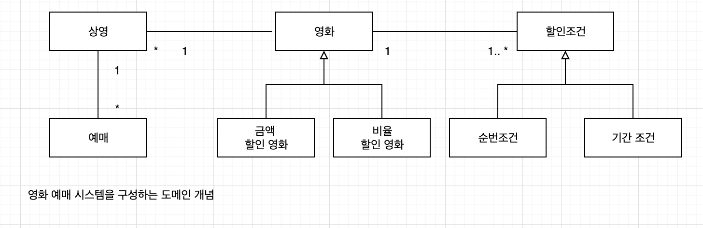

# chapter 05. 책임 할당하기. 

## 01. 책임 주도 설계를 향해

데이터 중심 설계에서 책임 중심 설계로 전환하기 위한 두가지 원칙 

* 데이터보다 행동을 먼저 결정하라
* 협력이라는 문맥 안에서 책임을 결정하라


### 데이터보다 행동을 먼저 결정하라.

클라이언트 관점에서 객체가 수행하는 행동이란 곧 객체의 책임이다. 

데이터는 객체가 책임을 수행하는데 필요한 재료일 뿐이다. 

너무 이른 시기에 데이터에 초점을 맞추면 객체의 캡슐화가 약화되기 때문에 낮은 응집도와 높은 결합도를 가진 객체들로 넘쳐나게 된다.

**객체의 데이터에서 행동으로 무게 중심을 옮기기 위한 기법**

* 객체를 설계하기 위한 질문의 순서를 바꾸기
  * 객체가 포함해야 하는 데이터가 무엇인가? 를 결정 후  이 데이터를 처리하는데 필요한 오퍼레이션은 무엇인가? 
  * 이 객체가 수행하는 책임은 무엇인가?  결정 후 이 책임을 수행하는데 필요한 데이터는 무엇인가? 

### 협력이라는 문맥 안에서 책임을 결정하라.

객체에게 할당된 책임이 협력에 어울리지 않는다면 그 책임은 나쁜것이다. 

객체의 책임을 어떻게 식별해야 하는가에 대한 힌트

* 책임은 객체의 입장의 아니라 객체가 참여하는 협력에 적합해야한다. 
* 협력을 시작하는 주체는 메시지 전송자이기 때문에 협력에 적합한 책임이란 메시지 수신자가 아닌 전송자에 적합한 책임


`객체가 메시지를 선택하는 것이 아니라 메시지가 객체를 선택하게 해야한다.`

> 클래스를 결정하고 그 클래스의 책임을 찾아나서는 대신 메시지를 결정하고 이 메시지를 누구에게 전송할지 찾아보게 되었다.  
>
> 클래스 기반 설계에서 메시지 기반 설계로의 자리바꿈은 우리가 해오던 설계 활동의 전환점이다. 메시지 기반의 설계 관점은 클래스 기반의 설계관점보다 훨씬 유연한 애플리케이션을 만들 수 있게 해준다. "이 클래스가 필요하다는 점은 알겠는데 이 클래스는 무엇을 해야 하지? " 라고 질문하지 않고 "메시지를 전송해야 하는데 누구에게 전송해야 하지?" 라고 질문하는 것. 설계의 핵심 질문을 이렇게 바꾸는 것이 메시지 기반 설계로 향하는 첫걸음이다. 
>
> 객체를 가지고 있기 때문에 메시지를 보내는 것이 아니다. 메시지를 전송하기 때문에 객체를 갖게 된 것이다. 

### 책임 주도 설계

**책임 주도 설계의 흐름**

* 시스템이 사용자에게 제공해야 하는 기능인 시스템 책임을 파악한다.
* 시스템 책임을 더 작은 책임으로 분할한다.
* 분할된 책임을 수행할 수 있는 적절한 객체 또는 역할을 찾아 책임을 할당한다.
* 객체가 책임을 수행하는 도중 다른 객체의 도움이 필요한 경우 이를 책임질 객체 또는 역할을 찾는다.
* 해당 객체 또는 역할에게 책임을 할당함으로써 두 객체가 협력하게 한다.


**책임 주도 설계의 핵심**

>  책임을 결정한 후에 책임을 수행할 객체를 결정하는 것


## 02. 책임 할당을 위한 GRASP 패턴

크레이그 라만(Craig Larman) - GRASP 패턴

`General Responsibility Assignment Software pattern (일반적인 책임 할당을 위한 소프트웨어 패턴)`

### 도메인 개념에서 출발하기





**올바른 도메인 모델이란 존재 하지 않는다.**


### 정보 전문가에게 책임을 할당하라

**첫번째 질문 ?**

`메시지를 전송할 객체는 무엇을 원하는가?`


**두번째 질문?**

`메시지를 수신할 적합한 객체는 누구인가?`

**객체에게 책임을 할당하는 첫번째 원칙은 책임을 수행할 정보를 알고 있는 객체에게 책임을 할당하는 것**


**Information Expert 패턴**

> 책임을 객체에 할당하는 일반적인 원리는? 책임을 정보 전문가, 즉 책임을 수행하는 데 필요한 정보를 가지고 있는 객체에게 할당하라.


### 높은 응집도와 낮은 결합도

**응집도와 결합도**

높은 응집도와 낮은 결합도는 객체에 책임을 할당할 때 항상 고려해야 하는 기본 원리.

* 책임을 할당할 수 있는 다양한 대안들이 존재한다면 응집도와 결합도의 측면에서 더 나은 대안을 선택하는 것이 좋다.


**Low Coupling(낮은 결합도) 패턴 **

> 어떻게 하면 의존성을 낮추고 변화의 영향을 줄이며 재사용성을 증가시킬 수 있을가? 설계의 전체적인 결합도가 낮게 유지되도록 책임을 할당하라.

**High Cohesion(높은 응집도) 패턴**

> 어떻게 복잡성을 관리할 수 있는 수준으로 유지할것인가? 높은 응집도를 유지할 수 있게 책임을 할당하라.
>
> 낮은 결합도 처럼 높은 응집도 역시 모든 설계 결정에서 염두에 두어야 할 원리다. 다시 말해 설계 결정을 평가할 때 적용할 수 잇는 평가 원리다. 

### 창조자에게 객체 생성 책임을 할당하라.

**Creator(창조자) 패턴**

> 객체 A 를 생성해야 할때 어떤 객체에게  생성 책임을 할당해야 하나? 아래 조건을 최대한 많이 만족하는 B에게 객체 생성 책임을 할당하라.
>
> * B가 A 객체를 포함하거나 참조한다.
> * B가 A 객체를 기록한다.
> * B가 A 객체를 긴밀하게 사용한다.
> * B가 A 객체를 초기화하는 데 필요한 데이터를 가지고 있다. ( 이 경우는 B는 A에 대한 정보전분가다.)


## 03. 구현을 통한 검증

...

### DiscountCondition 개선하기

변경의 이유

* 새로운 할인 조건 추가
* 순번 조건을 판단하는 로직 변경
* 기간 조건을 판단하는 로직 변경

**변경의 이유에 따라 클래스를 분리해야 한다. **


**클래스 응집도 판단하기**

> * 클래스가 하나 이상의 이유로 변경돼야 한다면 응집도가 낮은 것이다. 변경의 이유를 기준으로 클래스를 분리하라.
> * 클래스의 인스턴스를 초기화하는 시점에 경우에 따라 서로 다른 속성들을 초기화하고 있다면 응집도가 낮은것이다. 초기화 되는 속성의 그룹을 기준으로 클래스를 분리하라.
> * 메서드 그룹이 속성 그룹을 사용하는지 여부로 나뉜다면 응집도가 낮은 것이다. 이들 그룹을 기준으로 클래스를 분리하라.


### 타입 분리하기

```java
public class Movie{
  private List<PeriodCondition> periodConditions;
  private List<SequenceCondition> sequenceConditions;
  
  
}
```
**문제점**
1. Movie 클래스가 PeriodCondition , SequenceCondition과 결합된다.
2. 새로운 할인 조건을 추가하기가 더 어려워졌다. 


### 다형성을 통해 분리하기


**Polymorphism 패턴**

> 객체의 타입에 따라 변하는 로직이 있을 때 변하는 로직을 담당할 책임을 어떻게 할당해야 할까? 타입을 명시적으로 정의하고 각 타입에 다형적으로 행동하는 책임을 할당하라.
>
> 조건에 따른 변화는 프로그램의 기본 논리다. 프로그램을 if -else 또는 swith-case 등의 조건 논리를 사용하면 새로운 변화가 생길 경우 조건 논리를 수정해야 한다. 
>
> Polymorphism 패턴은 객체의 타입을 검사해서 타입에 따라 여러 대안들을 수행하는 조건적인 논리를 사용하지 말라고 경고한다. 대신 다형성을 이용해 새로운 변화를 다루기 쉽게 확장하라고 권고한다.


### 변경으로부터 보호하기

변경을 캡슐화 하고 책임을 할당하는 것

**Protected Variations (변경 보호) 패턴**

> 객체, 서브시스템, 그리고 시스템을 어떻게 설계해야 변화와 불안정성이 다른 요소에 나쁜 영향을 미치지 않도록 방지할 수 있을까? 변화가 예상되는 불안정한 지점들을 식별하고 그 주위에 안정된 인터페이스를 형성하도록 책임을 할당하라. 
>
> Protected Variations 패턴은 책임 할당의 관점에서 캡슐화를 설명한 것. "설계에서 변하는 것이 무엇인지 고려하고 변하는 개념을 캡슐화해라" 라는 객체지향의 오랜 격언은 변경보호 패턴의 본질을 설명해준다. **우리가 캡슐화해야 하는 것은 변경이다.**  변경이 될 가능성이 높은가? 그러면 캡슐화하라.

### Movie  클래스 개선하기

### 변경과 유연성

## 04. 책임 주도 설계의 대안

**리팩토링**

> 이해하기 쉽고 수정하기 쉬운 소프트웨어로 개선하기 위해 겉으로 보이는 동작은 바꾸지 않은 채 내부 구조를 변경하는 것


### 메서드 응집도

```java
package com.setin.study.objects.chapter04;

public class ReservationAgency {

    public Reservation reserve(Screening screening, Customer customer, int audienceCount) {
        Movie movie = screening.getMovie();
        boolean discountable = false;
        for (DiscountCondition condition : movie.getDiscountConditions()) {
            if (condition.getType() == DiscountConditionType.PERIOD) {
                discountable = screening.getWhenScreened()
                  .getDayOfWeek().equals(condition.getDayOfWeek())
                        && condition.getStartTime()
                  .compareTo(screening.getWhenScreened()
                             .toLocalTime()) <= 0
                        && condition.getEndTime()
                  .compareTo(screening.getWhenScreened()
                             .toLocalTime()) <= 0;

            } else {
                discountable = condition.getSequence() == screening.getSequence();
            }

            if (discountable) {
                break;
            }
        }
        Money fee;
        if (discountable) {
            Money discountAmount = Money.ZERO;
            switch (movie.getMovieType()) {
                case AMOUNT_DISCOUNT:
                    discountAmount = movie.getDiscountAmount();
                    break;
                case PERCENT_DISCOUNT:
                    discountAmount = movie.getFee().times(movie.getDiscountPercent());
                    break;

                case NONE_DISCOUNT:
                    discountAmount = Money.ZERO;
                    break;
            }
            fee = movie.getFee().minus(discountAmount).times(audienceCount);
        } else {
            fee = movie.getFee();
        }
        return new Reservation(customer, screening, fee, audienceCount);
    }
}

```


긴 메서드는 다양한 측면에서 코드 유지 보수에 부정적인 영향을 미친다. 

**몬스터 메소드 - 마이클 페더스(Michael Feathers)**

* 어떤 일을 수행하는지 한눈에 파악하기 어렵기 때문에 코드를 전체적으로 이해하는데 너무 많은 시간이 걸린다.
* 하나의 메서드 안에서 너무 많은 작업을 처리하기 때문에 변경이 필요할 때 수정해야 할 부분을 찾기 어렵다.
* 메서드 내부의 일부 로직만 수정하더라도 메서드의 나머지 부분에서 버그가 발생할 확률이 높다.
* 로직의 일부만 재사용하는 것이 불가능하다.
* 코드를 재사용하는 유일한 방법은 원하는 코드를 복사해서 붙여넣는 것뿐이므로 중복을 초래하기 쉽다.


```java
 public Reservation reserve(Screening screening, Customer customer, int audienceCount) {
        boolean discountable = checkDiscountable(screening);
        Money fee = calculate(screening, discountable, audienceCount);
        return createReservation(screening, customer, audienceCount, fee);
    }
```


### 객체를 자율적으로 만들자

```java
public class ReservationAgency {
   private boolean isDiscountable(DiscountCondition condition, Screening screening){
        if(condition.getType() == DiscountConditionType.PERIOD){
            return  isSatisfiedByPeriod(condition, screening);
        }
        return isSatisfiedBySequence(condition, screening);
    }

    private boolean isSatisfiedBySequence(DiscountCondition condition, Screening screening) {
        return condition.getSequence() == screening.getSequence();
    }

    private boolean isSatisfiedByPeriod(DiscountCondition condition, Screening screening) {
        return screening.getWhenScreened().getDayOfWeek().equals(condition.getDayOfWeek()) &&
                condition.getStartTime().compareTo(screening.getWhenScreened().toLocalTime()) <= 0 &&
                condition.getEndTime().compareTo(screening.getWhenScreened().toLocalTime()) >=0;
    }
}
```

```java
public class DiscountCondition {
    private DiscountConditionType type;
    private int sequence;
    private DayOfWeek dayOfWeek;
    private LocalTime startTime;
    private LocalTime endTime;

    public boolean isDiscountable(Screening screening) {
        if (type == DiscountConditionType.PERIOD) {
            return isSatisfiedByPeriod(screening);
        }
        return isSatisfiedBySequence(screening);
    }

    private boolean isSatisfiedBySequence(Screening screening) {
        return sequence == screening.getSequence();
    }

    private boolean isSatisfiedByPeriod(Screening screening) {
        return screening.getWhenScreened().getDayOfWeek().equals(dayOfWeek) &&
                startTime.compareTo(screening.getWhenScreened().toLocalTime()) <= 0 &&
                endTime.compareTo(screening.getWhenScreened().toLocalTime()) >= 0;
    }
}

```

* discountCondition 내부에서만 인자에 접근가능하고 완벽한 캡슐화를 이룰수 있다.


```java
public class ReservationAgency {
  private boolean checkDiscountable(Screening screening) {
    return screening.getMovie().getDiscountConditions().stream()
      .anyMatch(condition -> condition.isDiscountable(screening));
  }
}
```


* 메서드가 사용하는 데이터를 저장하고 있는 클래스로 메서드를 이동.

* 메서드를 다른 클래스로 이동시킬 때는 인자에 정의된 클래스 중 하나로 이동하는 경우가 일반적

* 데이터를 사용하는 메서드를 데이터를 가진 클래스로 이동시키고 나면 캡슐화와 높은 응집도, 낮은 결합도를 가지는 설계를 가지게 된다.


**책임 주도 설계방법에 익숙하지 않다면?**

데이터 중심으로 구현한 후 이를 래팩토링하더라도 유사한 결과를 얻을수 있다.  캡슐화, 결합도, 응집도를 이해하고 훌륭한 객체지향 원칙을 적용하기 위해 노력한다면 책임 주도 설계 방법을 단계적으로 따르지 않더라도 유연하고 깔끔한 코드를 얻을 수 있다.