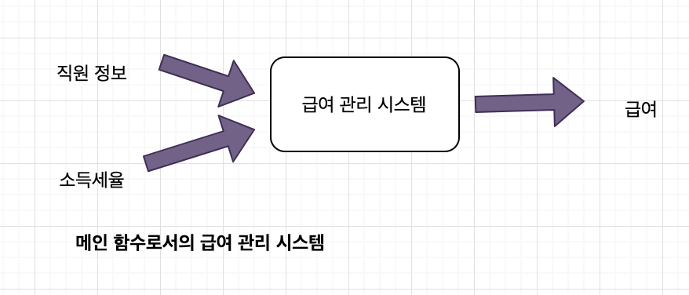
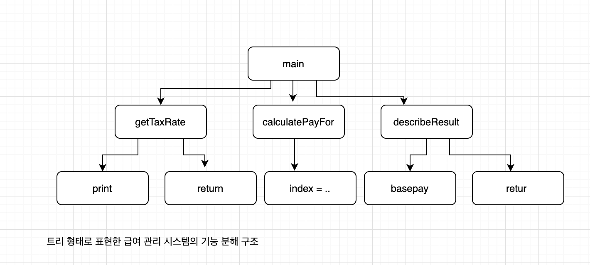

# chapter 07. 객체 분해

**인지과부하(cognitive overload)**

> 문제 해결에 필요한 요소의 수가 단기 기억의 용량을 초과하여 문제 해결 능력이 급격히 떨어지는 현상

**추상화**

> 불필요한 정보를 제거학 현재의 문제 해결에 필요한 핵심만 남기는 작업

**분해**

> 큰 문제를 해결 가능한 작은 문제로 나누는 작업


## 01. 프로시저 추상화와 데이터 추상화

**프로시저 추상화**

> 소프트웨어가 무엇을 해야 하는 지를 추상화

**데이터 추상화**

> 소프트웨어가 무엇을 알아야 하는지를 추상화


**시스템 분해방법**

* 프로시저 중심의 시스템 분해 -> 기능 분해 (알고리즘 분해)
* 데이터 추상화 중심으로 시스템 분해 
  * 데이터를 중심으로 타입을 추상화 -> 추상 데이터 타입
  * 데이터를 중심으로 포로시저를 추상화 -> 객체지향

## 02. 프로시저 추상화와 기능 분해

### 메인 함수로서의 시스템

**알고리즘 분해 - 기능 분해**

기능 중심의 데이터 분해 

**프로시저**

* 반복적으로 실행되거나 거의 유사하게 실행되는 작업들을 하나의 장소에 모아놓음으로써 로직을 재사용하고 중복을 방지할 수 있는 추상화 방법
* 내부의 상세한 구현 내용을 모르더라도 인터페이스만 알면 프로시저를 사용가능하기에 **추상화**라고 부른다.
* 정보은닉의 가능성은 제공하지만 프로시저만으로는 효과적인 정보은닉 체계 구축은 **어렵다.**

**전통적인 기능 분해 방법 - 하향식 접근법(top-down approach)**

* 시스템을 구성하는 최상위 기능을 정의하고 , 최상위 기능을 작은 단계의 하위 기능으로 분해하는 방법


### 급여 관리 시스템

```
직원의 급여를 계산한다.
	사용자로부터 소득세율을 입력받는다.
		"세율을 입력하세요: " 라는 문장을 화면에 출력한다.
		키보드를 통해 세율을 입력받는다.
  직원의 급여를 계산한다.
  	전역 변수에 저장된 직원의 기본급 정보를 얻는다.
  	급여를 계산한다.
 	양식에 맞게 결과를 출력한다.
 		"이름: {직원명}, 급여: {계산된 금액}" 형식에 따라 출력 문자열을 생성한다.
```





### 급여 관리 시스템 구현




### 하향식 기능 분해의 문제점


* 시스템은 하나의 메인 함수로 구성돼 있지 않다.
* 기능 추가나 요구사항 변경으로 인해 메인 함수를 빈번하게 수정해야 한다.
* 비즈니스 로직이 사용자 인터페이스와 강하게 결합된다.
* 하향식 분해는 너무 이른 시기에 함수들의 실행 순서를 고정시키기 때문에 유연성과 재사용성이 저하된다.
* 데이터 형식이 변경될 경우 파급효과를 예측할수 없다.

#### **하나의 메인 함수라는 비현실적인 아이디어**

어떤 시스템도 최초에 릴리즈됐던 당시의 모습을 그대로 유지하지 않는다. 

시간이 지나고 사용자를 만족시키기 위한 새로운 요구사항을 도출해나가면서 지속적으로 새로운 기능을 추가하게 된다.

대부분의 시스템에서는 하나의 메인 기능이란 개념은 존재하지 않는다. 

하향식 접근법은 하나의 알고리즘을 구현하거나 배치 처리를 구현하기에는 적합하지만 현대적인 상호작용 시스템을 개발하는 데는 적합하지 않다. 현대적인 시스템은 동등한 수준의 다양한 기능으로 구성된다. 


#### **메인 함수의 빈번한 재설계**

#### **비즈니스 로직과 사용자 인터페이스의 결합**

하향식 접근법은 비즈니스 로직을 설계하는 초기 단계부터 입력 방법과 출력 양식을 함께 고민하도록 강요한다. 

결과적으로 코드 안에서 비즈니스 로직과 사용자 인터페이스 로직이 밀접하게 결합된다. 

비즈니스 로직과 사용자 인터페이스가 변경되는 빈도가 다른데 탑다운 방식에서는 동일하게 두고 사용하고 있다. 

하향식 접근법은 기능을 분해하는 과정에서 사용자 인터페이스의 관심사와 비즈니스 로직의 관심사를 동시에 고려하도록 강요하기 때문에 "관심사의 분리" 라른 아키텍처 설계의 목적을 달성하기 어렵다.

#### **성급하게 결정된 실행 순서**

하향식 설계와 관련된 모든 문제의 원인은 **결합도**

함수는 상위 함수가 강요하는 문맥에 강하게 결합되어짐. 

가장 큰 문제는 전체 시스템의 핵심적인 구조를 결정하는 함수들이 데이터와 강하게 결합된다는 점

### 언제 하향식 분해가 유용한가?

설계가 어느정도 안정화 된 후 설계의 다양한 측면을 논리적으로 설명하고 문서화하기에 용이.

## 03. 모듈

### 정보 은닉과 모듈

**정보은닉**

> 시스템을 모듈 단위로 분해하기 위한 기본원리로 시스템에서 자주 변경되는 부분을 상대적으로 덜 변경되는 안정적인 인터페이스 뒤로 감춰야 하는 것 


시스템을 모듈로 분할하는 원칙 - 데이비드 파나스 

> 모듈은 서브 프로그램이라기 보다는 책임의 할당이다. 
>
> 모듈화는 개별적인 모듈에 대한 작업이 시작되기 전에 정해져야 하는 설계 결정들을 포함한다. 분할된 모듈은 다른 모듈에 대해 감춰야 하는 설계 결정에 따라 특징지어진다. 해당 모듈내부의 작업을 가능한 한 적게 노출하는 인터페이스 또는 정의를 선택한다. 


**모듈은**

* 변경될 가능성이 있는 비밀을 내부로 감추고, 잘 정의되고 변경되지 않을 퍼블릭 인터페이스를 외부에 제공해서 내부의 비밀에 함부로 접근하지 못하게 한다. 

**모듈이 감추어야 할 비밀 두가지**

1. 복잡성 
   - 모듈이 너무 복잡한 경우 사용하기 어렵다. 외부에 모듈을 추상화할 수 있는 간단한 인터페이스를 제공해서 모듈의 복잡도를 낮춘다.
2. 변경가능성
   - 벽녕 가능한 설계 결정이 외부에 노출될 경우 실제로 변경이 발생했을 때 파급효과가 커진다. 변경 발생 시 하나의 모듈만 수정하면 되도록 변경 가능한 설계 결정을 모듈 내부로 감추고 `외부에는 쉽게 변경되지 않을 인터페이스를 제공한다.`

### 모듈의 장점과 한계

**모듈의 장점** 

1. 모듈 내부의 변수가 변경되더라도 모듈 내부에만 영향을 미친다.
   - 모듈 내부에 정의된 변수를 직접 참조하는 코드의 위치를 모듈 내부로 제한할 수 있다. 
2. 비즈니스 로직과 사용자 인터페이스에 대한 관심사를 분리한다.
   - 모듈은 비즈니스 로직과 관련된 관심사만 담당하며. 사용자 인터페이스가 변경되더라도 비즈니스 로직은 변경되지 않는다.
3. 전역 변수와 전역 함수를 제거함으로써 네임스페이스 오염을 방지한다.
   - 변수와 함수를 모듈 내부에 포함시키기 때문에 다른 모듈에서도 동일한 이름을 사용할 수 있다. 


모듈은 기능이 아니라 변경의 정도에 따라 시스템을 분해하게 한다.

메인 함수를 정의하고 필요에 따라 더 세부적인 함수로 분해하는 하향힛 기능 분해와 달리 모듈은 감춰야 할 데이터를 결정하고 이 데이터를 조적하는데 필요한 함수를 결정한다.

**모듈의 가장 큰 단점**은 `인스턴스의 개념을 제공하지 않는다는 점`.


## 04. 데이터 추상화와 추상 데이터 타입

### 추상 데이터 타입

추상데이터 타입을 구현하기 위한 프로그래밍 언어의 지원 사항

* 타입의 정이를 선언할 수 있어야한다.

* 타입의 인스턴스를 다루기 위해 사용할 수 있는 오퍼레이션을정의할 수 있어야 한다.

* 제공된 오퍼레이션을 통해서만 조작할 수 있도록 데이터를 외부로부터 보호할 수 있어야한다.

* 타입에 대해 여러개의 인스턴스를 생성할 수 잇어야 한다. 

  

## 05.클래스

### 클래스는 추상 데이터 타입인가?

**클래스와 추상데이터 타입의 차이**

클래스는 상속과 다형성을 지원하는데 비해 추상 데이터 타입은 지원하지 못한다 는 점

### 변경을 기준으로 선택하라

객체지향에서는 타입 변수를 이용한 조건문을 다형성으로 대체한다.

클라이언트가 객체의 타입을 확인 한 후 적절한 메서드를 호출하는 것이 아니라 객체가 메시지를 처리할 적절한 메서드를 선택하도록 한다.


**개방폐쇄원칙**

> 기존 코드에 아무런 영향도 미치지 않고 새로운 객체 유형과 행위를 추가할 수 있는 객체지향의 특성


새로운 타입을 빈번하게 추가해야한다면 -> 객체지향의 클래스가 유용

새로운 오퍼레이션을 빈번하게 추가해야한다면 -> 추상 데이터 타입

### 협력이 중요하다

객체지향에서 중요한 것은 역할, 책임, 협력이다. 

협력이라는 문맥을 고려하지 않고  객체를 고립시킨 ㅂ 계층과 다형성은 ㅎ채 오퍼레이션의 구현 방식을 타입별로 분배하는 것은 옳은 방법이 아니다. 

객체가 참여할 협력을 결정하고 협력에 필요한 책임을 수행하기 위해 어떤 객체가 필요한지에 관해 고민하고 , 그 책임을 다양한 방식으로 수행해야 할 때만 타입 계층 안에 각 절차를 추상화 하라. 타입 계층과 다형성은 협력이라는 문맥 안에서 책임을 수행하는 방법에 관해 고민한 결과물이어야 하며 그 자체가 목적이 되서는 안된다.

