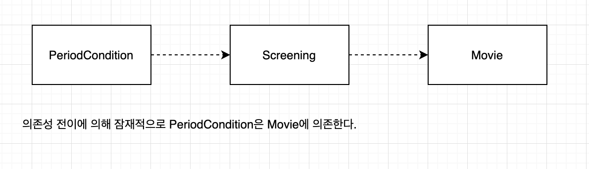
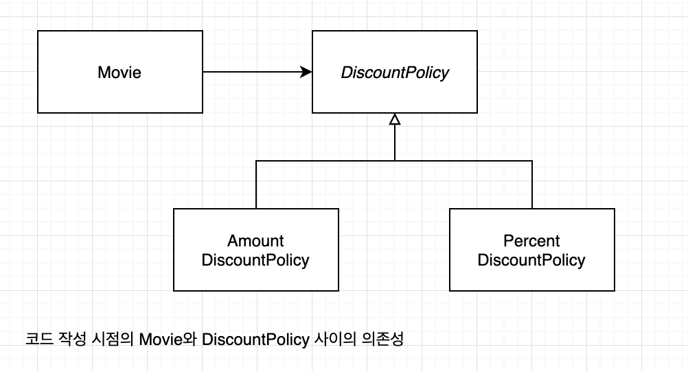
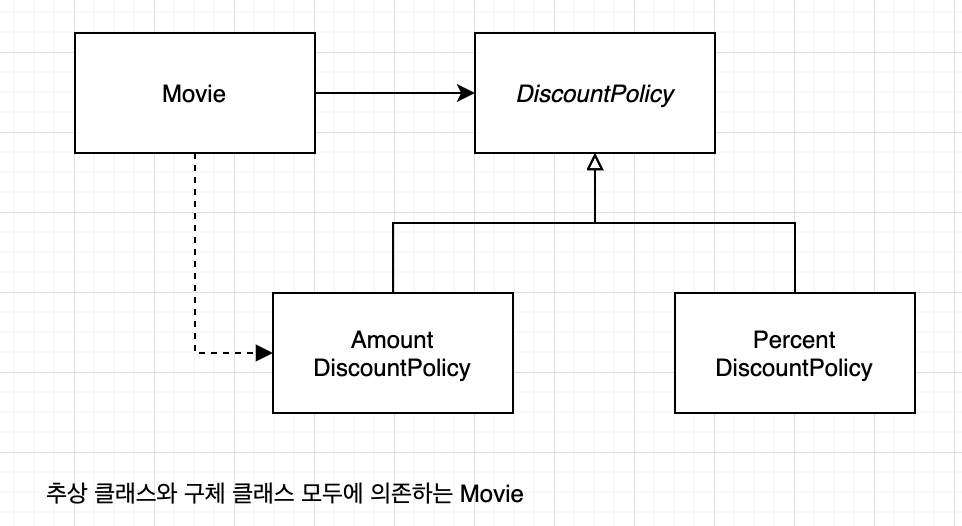

# chapter 08. 의존성 관리하기

## 01. 의존성 이해하기

잘 설계된 객체지향 애플리케이션은 작고 응집도 높은 객체들로 구성된다.

작고 응집도 높은 객체란? 책임의 초점이 명확하고 한가지 일만 잘하는 객체를 의미.

협력은 필수적이다. 하지만 과도한 협력은 설계를 곤경에 빠뜨린다. 

객체지향 설계의 핵심은 협력을 위해 필요한 의존성은 유지하면서도 변경을 방해하는 의존성은 제거하는데 있다. 이런 관점에서 

**객체지향 설계란?**

>  의존성을 관리하는 것이고 객체가 변화를 받아들일 수 있게 의존성을 정리하는 기술이라 할수 있다.

### 변경과 의존성

어떤 객체가 협력하기 위해 다른 객체를 필요로 할때 두 객체 사이에 의존성이 존재하게 된다.

의존성은 실행시점과 구현 시점에 다른 의미를 가진다.

* 실행시점 : 의존하는 객체가 정상적으로 동작하기 위해서는 실행 시에 의존 대상 객체가 반드시 존재해야 한다.
* 구현 시점: 의존 대상 객체가 변경될 경우 의존하는 객체도 함께 변경된다.

~~~java
public Class PeriodCondition implements DiscountCondition {
	private DayOfWeek dayOfWeek;
  private LocalTime startTime;
  private LocalTime endTime;
  
  public boolean isSatisfiedBy(Screening screening) {
    return ...;
  }
  
}
~~~

---

두 요소 사이의 의존성은 의존되는 요소가 변경될때 의존하는 요소도 함께 변경될 수 있다는 것을 의미한다. 따라서 의존성은 변경에 의한 영향의 전파 가능성을 암시한다.

### 의존성 전이

* 의존성 전이가 의미하는것은 peridoCondition이 Screening에 의존할 경우 PeriodCondition은 Screening이 의존하는 대상에 대해서도 자동적으로 의존하게 된다는 것.

**의존성의 종류**

* 직접 의존성 : 한 요소가 다른 요소에 직접 의존하는 경우를 가르킨다.
  * ex ) periodCondition 이 screening에 의존하는 경우
* 간접 의존성  : 직접적인 관계는 존재하지 않지만 의존성 전이에 의해 영향이 전파되는 경우를 가르킨다.

### 런타임 의존성과 컴파일타임 의존성

* 런타임 의존성
  * 애플리케이션이 실행되는 시점
* 컴파일타임 의존성
  * 작성된 코드를 컴파일 하는 시점을 가르키지만 문맥에 따라서는 코드 자체를 가르키기도 한다.

>객체지향 프로그램의 실행 구조는 소스코드 구조와 일치하지 않는 경우가 종종 있다. 코드 구조는 컴파일 시점에 확정되는 것이고 이 구조에는 고정된 상속 클래스 관계들이 포함된다. 그러나 프로그램의 실행 시점 구조는 협력하는 객체에 따라서 달라질 수 있다. 즉, 두 구조는 전혀 다른 별개의 독립성을 갖는다. 하나로부터 다른 하나를 이해하려는 것은 생태계의 동적인 성질을 식물과 동물과 같은 정적 분류 구조를 바탕으로 이해하려 하는 것과 똑같다. 컴파일 시점의 구조와 실행 시점 구조 사이에 차이가 있기 때문에 코드 자체가 시스템의 동작 방법을 모두 보여줄수 없다. 시스템의 실행 시점 구조는 언어가 아닌 설계자가 만든 타입들 간의 관련성으로 만들어진다. 그러므로 객체와 타입 간의 관계를 잘 정의해야 좋은 실행 구조를 만들어 낼수 있다.

### 컨텍스트 독립성

> 클래스가 사용될 특정한 문맥에 대해 최소한의 가정으로만 이루어 져 있다면 다른 문맥에서 재사용하기 수월해진다. 
>
> 설계가 유연해지기 위해서는 가능한 한 자신이 실행될 컨텍스트에 대한 구체적인 정보를 최대한 적게 알아야한다.

### 의존성 해결하기

**의존성 해결**

컴파일타임 의존성을 실행 컨텍스트에 맞는 적절한 런타임 의존성으로 교체하는 것

**의존성 해결을 위한 방법 세가지**

* 객체를 생성하는 시점에 생성자를 통해 의존성 해결
* 객체 생성 후 setter 메서드를 통해 의존성 해결
* 메서드 실행 시 인자를 이용해 의존성 해결

## 02. 유연한 설계

### 의존성과 결합도

### 지식이 결합을 낳는다

결합도의 정도는 한 요소가 자신이 의존하고 있는 다른 요소에 대하 알고 있는 정보의 양으로 결정된다. 한 요소가 다른 요소에 대하 더 많은 정보를 알고 있을수록 두 요소는 강하게 결합된다. 

**더 많이 알수록 더 많이 결합된다.**

더 많이 알고 있다는 것은 더 적은 컨텍스트에서 재사용 가능하다는 것을 의미한다.

### 추상화에 의존하라

**추상화란?**

어떤 양상, 세부사항 , 구조를 좀 더 명확하게 이해하기 위해 특정 절차나 물체를 의도적으로 생략하거나 감춤으로써 복잡도를 극복하는 방법이다. 

**결합도가 큰 순서**

1. 구체 클래스 의존성
2. 추상 클래스 의존성
3. 인터페이스 의존성

**결합도를 느슨하게 만들기 위해서는?**

구체적인 클래스보다는 추상 클래스에, 추상 클래스 보다는 인터페이스에 의존하도록 만드는 것이 효과적이다.

의존하는 대상이 추상적일 수록 결합도는 낮아진다.

### 명시적인 의존성

~~~java
public class Movie {
...
private DiscountPolicy discountPolicy;
  
  public Movie(String title, Duration runningTime, Money fee){
    ...
      this.discountPolity = new AmountDiscountPolicy(...);
  }
}
~~~

**숨겨진 의존성(hidden dependency)** 

**명시적 의존성(explicit dependency)**

명시적으로 퍼블릭 인터페이스에 노출시킴

~~~java
public class Movie {
...
private DiscountPolicy discountPolicy;
  
  public Movie(String title, Duration runningTime, Money fee, DiscountPolicy discountPolicy){
    ...
      this.discountPolity = discountPolicy;
  }
}
~~~

---

의존성이 명시적이지 않으면 클래스를 다른 컨텍스트에서 재사용하기 위해 내부 구현을 직접 변경해야 한다. 코드 수정은 언제나 버거 발생가능성을 내포한다. 의존성을 명시적으로 드러내면 코드를 직접 수정해야하는 위험을 피할 수 있다.

의존성은 명시적으로 표현되야 한다. 의존성을 구현 내부에 숨겨두지 마라. 명시적은 의존성을 사용해야만 퍼블릭 인터페이스를 통해 컴파일 타임 의존성을 적절한 런타임 의존성으로 교체할 수 있다.

### new 는 해롭다

**결합도 측면에서 new 가 해로운 이유 두가지**

* new 연산자를 사용하기 위해서는 구체 클래스의 이름을 직접 기술해야 한다. 따라서 new 를 사용하는 클라이언트는 추상화가 아닌 구체 클래스에 의존할 수 밖에 없기 때문에 결합도가 높아진다.
* new 연산자는 생성하려는 구체 클래스뿐 아니라 어떤 인자를 이용해 클래스의 생성자를 호출해야 하는지도 알아야 한다. 따라서 new 를 사용하면 클라이언트가 알아야 하는 지식의 양이 늘어나기 때문에 결합도가 높아진다. 

~~~java
public class Movie {
...
private DiscountPolicy discountPolicy;
  
  public Movie(String title, Duration runningTime, Money fee, DiscountPolicy discountPolicy){
    ...
      this.discountPolity = new AmountDiscountPolicy(Money.wons(800),
                                 new SequenceCondition(1), 
                                 new SequenceCondition(10), 
                                 new PriodCondition(....), 
                                 new PriodCondition(....)
                                     				);
  }
}
~~~

### 표준 클래스에 대한 의존은 해롭지 않다

~~~java
public abstract class DiscountPolicy {
	private List<DiscountCondition> conditions = new ArrayList();
}
~~~

의존성에 의한 영향이 적은 경우데도 추상화에 의존하고 의존성을 명시적으로 드러내는 것은 좋은 설계 습관이다.

~~~java
public abstract class DiscountPolicy {
	private List<DiscountCondition> conditions = new ArrayList();
  
  public void switchConditions(List<DiscountCondition> conditions){
    this.conditions = conditions;
  }
}
~~~

### 조합 가능한 행동

유연하고 재사용 가능한 설계는 작은 객체들의 행동을 조합함으로써 새로운 행동을 이끌어낼 수 있는 설계다. 

훌륭한 객체지향 설계란 객체가 어떻게 하는지를 표현하는 것이 아니라 객체들의 조합을 선언적으로 표현함으로써 객체들이 무엇을 하는지를 표현하는 설계다. 그리고 지금까지 설명한 것처럼 이런 설계를 창조하는데 있어서의 핵심은 의존성을 관리하는 것이다.

