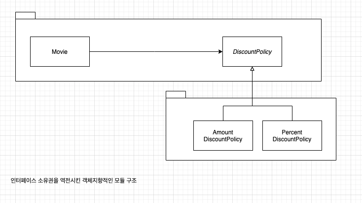

# chapter 09. 유연한 설계

## 01. 개방-폐쇄 원칙

**개방-폐쇄 원칙(Open-Closed Principle)**

> 소프트웨어 개체(클래스, 모듈, 함수 등등)는 확장에 대해 열려있어야 하고 수정에 대해서는 닫혀 있어야한다.


확장, 수정

* 확장에 대해 열려 있다 : 애플리케이션의 요구사항이 변경될 때 이 변경에 맞게 새로운 '동작'을 추가해서 애플리케이션의 기능을 확장할 수 있다.
  * 수정에 대해 닫혀 있다 : 기존의 '코드'를 수정하지 않고도 애플리케이션의 동작을 추가하거나 변경할 수 있다.


### 컴파일타임 의존성을 고정시키고 런타임 의존성을 변경하라


**확장에는 열려있고 수정에는 열려있는 할인 정책 설계**


### 추상화가 핵심이다.
```java
public abstract class DiscountPolicy {

	private List<DiscountCondition> conditions = new ArrayList<>();


	public DiscountPolicy(List<DiscountCondition> conditions) {
		this.conditions = conditions;
	}

	public Money calculateDiscountAmount(Screening screening){
		for (DiscountCondition condition : conditions) {
			if(condition.isSatisfiedBy(screening)){
				return getDiscountedFee(screening);
			}
		}
		return screening.getMovie().getFee();
	}

	abstract protected Money getDiscountedFee(Screening screening);
}

```


```java

public class Movie {
	private DiscountPolicy discountPolicy;

	private Money fee;
	public Movie(String title, Duration runningTime, Money fee, DiscountPolicy discountPolicy){
		this.discountPolicy = discountPolicy;
		this.fee = fee;
	}

	public Money calucateMovieFee(Screening screening){
		return fee.minus(discountPolicy.calculateDiscountAmount(screening));
	}
}
```


* 어떤 개념을 추상화했다고 해서 수정에 대해 닫혀 있는 설계를 만들수 있는 것은 아니다. 개방-폐쇄 원칙에서 폐쇄를 가능하게 하는 것은 의존성 방향이다. `수정에 대한 영향을 최소화하기 위해서는 모든 요소가 추상화에 의존해야 한다.`

* Movie는 할인 정책을 추상화한 DiscountPolicy에 대해서만 의존한다. 의존성은 변경의 영향을 의미하고 DiscountPolicy는 변하지 않는 추상화라는 사실에 주목하라. Movie는 안정된 추상화인 DiscountPolicy에 의존하기 때문에 할인 정책을 추가하기 위해 DiscountPolicy의 자식 클래스를 추가하더라도 영향을 받지 않는다. 
* 따라서 Movie 와 DiscountPolicy 는 `수정에 닫혀있다.`


## 02. 생성 사용 분리

**예제 **

- 아래 예제에서 **AmountDiscountPolicy**에서 **PercentDiscountPolicy**로 변경할수 있는 방법은 코드를 직접 수정하는 것뿐이다.

```java

public class Movie {
	private DiscountPolicy discountPolicy;

	private Money fee;
	public Movie(String title, Duration runningTime, Money fee, DiscountPolicy discountPolicy){
		this.discountPolicy = new AmountDiscountPolicy(....);
		this.fee = fee;
	}

	public Money calucateMovieFee(Screening screening){
		return fee.minus(discountPolicy.calculateDiscountAmount(screening));
	}
}
```


* 결합도가 높아질수록 개방-폐쇄 원칙을 따르는 구조를 설계하기가 어려워진다. 
* 객체생성을 피할수는 없다. 하지만 부적절한 곳에서 객체를 생성하는 것이 문제다. 


**객체에 대한 생성과 사용을 분리**

> 소프트웨어 시스템은 (응용 프로그램 객체를 제작하고 의존성을 서로 "연결" 하는) 시작 단계와 ( 시작 단계 이후에 이어지는) 실행단계를 분리해야 한다. [Martin08]


**Client 에게 생성을 위임하고 Movie는 DiscountPolicy의 사용만 해야한다.**


```java 
public class Client {
  	public Money getAvatarFee(){
      Movie avatar = new Movie("아바타", 
                               Duration.ofMinutes(120), 
                               Money.wons(10000),
                               new AmountDiscountPolicy(...));
      return avatar.getFee();
    }
}
```


### FACTORY 추가하기

**객체 생성을 전담하는 Factory를 추가한 후의 의존성**


### 순수한 가공물에게 책임 할당하기

**PURE FABRICATION 패턴**

객체지향 설계는 문제 도메인 상의 개념을 소프트웨어 객체로 구현하고 책임을 할당한다. 하지만 만약 도메인 객체에 대한 책임을 할당할 경우  High Choosen, Low Coupling, 재사용성 등의 목적을 위반한다면 어떻게 해야 하는가?

문제 도메인 개념을 표현하지 않는 인위적으로 또는 편의상 만든 클래스에 매우 응집된 책임을 할당하라. 이들 클래스는 문제 도메인 상에는 존재하지 않지만 순수하게 전체 설계의 품질을 높이기 위해 설계자의 임의에 따라 추가한 상상 속의 가공물이다.

Pure Fabirication은 Information Expert 패턴에 따라 책임을 할당한 결과가 바람직하지 않을 경우 대안으로 사용된다. 어떤 객체가 책임을 수행하는데 필요한 많은 정보를 가졌지만 해당 책임을 할당할 경우 응집도가 낮아지고 결합도가 높아진다면 가공의 객체를 추가해서 책임을 옮기는 것을 고민하라. 순수한 가공물이라는 표현은 적절한 대안이 없을 때 사람들이 창조적인 무언가를 만들어낸다는 것을 의미하는 관용적인 표현이다.


## 03. 의존성 주입


**의존성 주입(Dependency Injection)**

> 사용하는 객체가 아닌 외부의 독립적인 객체가 인스턴스를 생성한 후 이를 전달해서 의존성을 해결하는 방법


**의존성을 해결하는 세가지 방법**

* 생성자 주입(constructor injection): 객체를 생성하는 시점에 생성자를 통해 의존성 해결
* Setter 주입(setter injection) : 객체 생성 후 setter 메서드를 통한 의존성 해결
* 메서드 주입(method injection) : 메서드 실행 시 인자를 이용한 의존성 해결

### 숨겨진 의존성은 나쁘다

**Service Locator 패턴**

```java
public class ServiceLocator {
	private static ServiceLocator soleInstance = new ServiceLocator();
	private DiscountPolicy discountPolicy;

	private ServiceLocator() {
	}

	public static DiscountPolicy discountPolicy() {
		return soleInstance.discountPolicy;
	}

	public static void provide(DiscountPolicy discountPolicy) {
		soleInstance.discountPolicy = discountPolicy;
	}
}
```

```java
ServiceLocator.provie(new AmountDiscountPolicy(...));
Movie avatar = new Movie("아바타", 
                        Duration.ofMinutes(120), 
                        Money.wons(1000));

ServiceLocator.provie(new PercentDiscountPolicy(...));
Movie avatar = new Movie("아바타", 
                        Duration.ofMinutes(120), 
                        Money.wons(1000));


```

Avatar Movie 생성 코드는 의존성이 감추어져 있다. 


문제의 원인은 숨겨진 의존성이 캡슐화를 위반했기 때문이다. 단순히 인스턴스 변수의 가시성을 private로 선언하고 변경되는 내용을 숨겼다고해서 캡슐화가 지켜지는 것은 아니다. 


캡슐화는 코드를 읽고이해하는 행위와 관련이 있다. 클래스의 퍼블릭 인터페이스만으로 사용 방법을 이해할 수 있는 코드가 캡술화의 관점에서 훌륭한 코드다. 클래스의 사용법을 익히기 위해 구현 내부를 샅샅이 뒤져야 한다면 그 클래스의 캡슐화는 무너질 것이다.


## 04. 의존성 역전 원칙
### 추상화와 의존성 역전

1. 상위 수준의 모듈은 하위 수준의 모듈에 의존해서는 안된다. 둘 모두 추상화에 의존해야 한다.
2. 추상화는 구체적인 사항에 의존해서는 안된다. 구체적인 사항은 추상화에 의존해야한다.


### 의존성 역전 원칙과 패키지





## 05. 유연성에 대한 조언
### 유연한 설계는 유연성이 필요할 때만 옳다

> 유연하고 재사용 가능한 설계란 런타임 의존성과 컴파일 타임 의존성의 차이를 인식하고 동일한 컴파일 타임 의존성으로부터 다양한 런타임 의존성을 만들 수 있는 코드를 가지는 설계를 의미한다.

- 설계의 미덕 = `단순함`,`명확함`
- 미래의 변경이 일어날지도 모른다는 막연한 불안감을 불필요하게 복잡한 설계를 낳음


> 아직 일어나지 않는 변경은 변경이 아니다.

- 유연함은 단순성과 명확성의 희생 위에서 자라남
- 불필요한 유연성은 불필요한 복잡성을 낳음
- 유연성은 코드를 읽는 사람들이 복잡함을 수용할 수 있을 때만 가치가 있음
- 프로그램(텍스트 공간에 흩뿌려진) 과 진행 과정 사이를 가능한 한 일치시켜야 함

### 협력과 책임이 중요하다

- 객체의 협력과 책임이 중요
- 설계를 유연하게 만들기 위헤서는 `역할`, `책임`, `협력`에 초점을 맞춰야함
- 객체를 생성하는 방법에 대한 결정은 모든 책임이 자리 잡은 후 마지막 시점에 내리는 것이 적절
- 객체가 무엇이 되고 싶은지를 알게 될 때까지 객체들은 어떻게 인스턴스화 할 것인지에 대해 전혀 신경 쓰지 않음
- 너무 일찍 결정하는 것은 비생산적임

> 역할, 책임, 협력에 먼저 집중하라.


