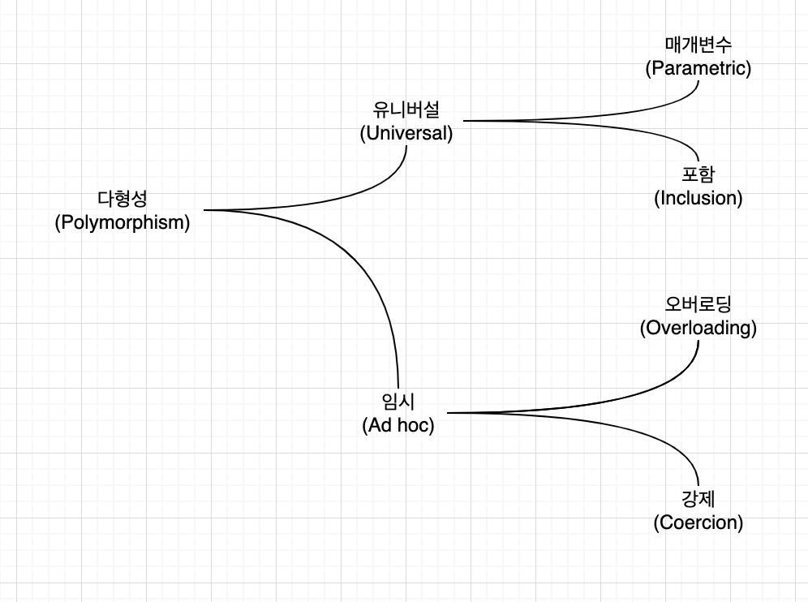
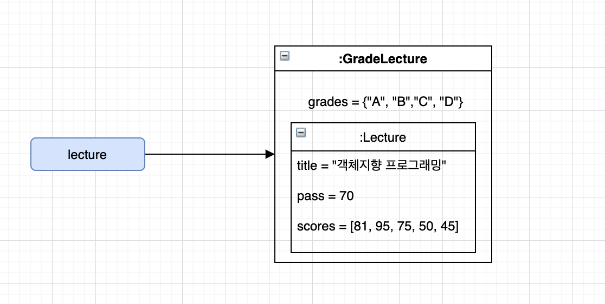
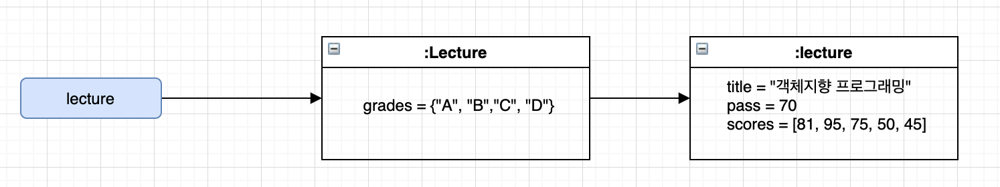

# chapter 12 . 다형성

**상속의 목적**

> 상속은 타입 계층을 구조화하기 위해 사용해야한다.
>
> 코드 재사용을 위해 사용해서는 안된다.


상속을 사용하려는 목적

1. 단순히 코드를 재사용하기 위해서?
   1. `상속을 사용하면 안된다.`
2. 클라이언트 관점에서 인스턴스들을 동일하게 행동하는 그룹으로 묶기 위해서?


## 01 다형성

**다형성(Polymorphism)**

**다형성의 분류**




* 오버로딩 다형성

  * 하나의 클래스 안에 동일한 이름의 메서드가 존재하는 경우
  * ex) Money 클래스 안에 서로 다른 타입의 파라미터를 받아 금액을 증가시키는 메서드 plus를 가짐

```java
	public class Money{
		public Money plus(Money amount) {}
		public Money plus(BigDecimal amount) {}
		public Money plus(long amount) {}
	}
```

* 강제 다형성
  * 언어가 지원하는 자동적인 타입 변환이나 사용자가 직접 구현한 타입 변환을 이용해 동일한 연산자를 다양한 타입에 사용할 수 있는 방식
  * ex) 자바 이항 연산자 '+' 는 정수인 경우 정수 덧셈, 문자열인 경우 연결 연산자로 동작
  
* 매개변수 다형성
  * 클래스의 인스턴스 변수나 메서드의 매개변수 타입을 임의의 타입으로 선언한 후 사용하는 시점에 구체적인 타입으로 지정하는 방식
  * ex) 자바의 List 인터페이스는 컬렉션에 보관할 요소의 타입을 임의의 타입 T로 지정하고 있으며 실제 인스턴스를 생성하는 시점에 T를 구체적인 타입으로 지정할수 있게 하고 있다. 따라서 List 인터페이스는 다양한 타입의 요소를 다루기 위해 동일한 오퍼레이션을 사용할 수 있다.
  
* 포함 다형성

  * 메시지가 동일하더라도 수신한 객체의 타입에 따라 실제로 수행되는 행동이 달라지는 능력
  * 서브타입 다형성이라고도 부른다.
  * 특별한 언급없이 다형성이라 할때는 포함 다형성을 의미하는 것이 일반적
  * ex)
  
  ```java
  public class Movie {
    private DiscountPolicy discountPolicy;
    
    public Money calculateMoveiFee(Screening screening){
      return fee.minus(discountPolicy.calcuateDiscountAmount(screening));
    }
  }
  ```
  
  

## 02. 상속의 양면성


객체지향 패러다임의 근간을 이루는 아이디어는 데이터와 행동을 객체라고 불리는 하나의 실행 단위안으로 통합한은 것.


상속의 목적은 코드의 재사용이 아니다.  상속은 프로그래밍을 구성하는 개념들을 기반으로 다형성을 가능하게 하는 타입 계층을 구축하기 위한 것이다.


**상속의 매커니즘을 이해하는데 필요한 개념 5가지**

* 업캐스팅
* 동적 메서드 탐색
* 동적 바인딩
* self 참조
* super 참조


### 상속을 위한 강의 평가

### 데이터 관점의 상속

```java
Lecture lecture = new Lecture("객체지향 프로그래밍", 70, Arrays.asList(81,95, 75, 50, 45));
```

```java
Lecture lecture = new GradeLecture("객체지향 프로그래밍", 70, 
                                   Arryas.asList(new Grade("A", 100, 95), 
                                                new Grade("B", 94, 80),
                                                 new Grade("C", 79, 70),
                                                 new Grade("D", 69, 50),
                                                 new Grade("F", 49, 0),
                                                )
                                   Arrays.asList(81,95, 75, 50, 45));
```


**부모 클래스의 인스턴스를 포함하는 자식 클래스**




**인스턴스 간의 링크로 표현된 상속 관계**




### 행동 관점의 상속

**행동 관점의 상속이란?**

> 부모 클래스가 정의한 일부 메서드를 자식 클래스의 메서드로 포함시키는 것을 의미


