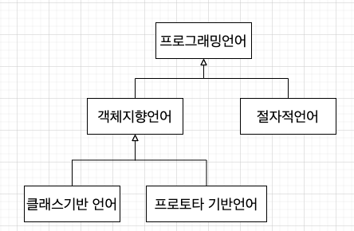
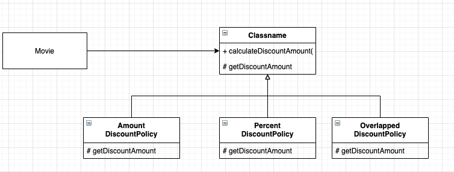

# 13. 서브클래싱과 서브타이핑

**상속의 두가지 용도**

* 타입 계층을 구현
  * 부모 클래스는 자식 클래스의 일반화(genralization)
  * 자식 클래스는 부모 클래스의 특수화(specialization)
* 코드 재사용
  * 간단한 선언으로 부모 클래스의 코드를 재사용할수 있다.
  * 재사용을 위해 상속을 사용할 경우 부모 클래스와 자식 클래스가 강하게 결합되기에 변경하기 어려운 코드를 얻게 될 확률이 높다. 

동일한 메세지에 대해 서로 다르게 행동할 수 있는 다형적인 객체를 구현하기 위해서는 객체의 행동을 기반으로 타입 계층을 구성해야 한다. 

**객체지향 프로그래밍과 객체기반 프로그래밍**

>* **객체기반 프로그래밍(Object-Based Programming)** : 상태와 행동을 캡슐화한 객체를 조합해서 프로그램을 구성하는 방식
>
>*  **객체지향 프로그래밍(Object-Oriented Programming)** : 객체기반 프로그래밍의 한 종류 
>  * **상속 과 다형성** 을 지원한다는 점에서 객체기반 프로그래밍과 차별화됨.
>* 프로토타입 기반언어 관점 
>  * 객체지향 프로그래밍 : 클래스를 사용하는 프로그래밍 방식
>  * 객체기반 프로그래밍 : 클래스 없이 객체만을 사용하는 프로그래밍 방식

## 01. 타입

### **개념 관점의 타입**

* **심볼(symbol)** : 타입에 이름을 붙인 것.
* **내연(intension)** : 타입의 정의로서 타입에 속하는 객체들이 가지는 공통적인 속성이나 행동을 가리킨다. 일반적으로 타입에 속하는 객체들이 공유하는 속성과 행동의 집합이 내연을 구성한다.
* **외연(extension)** : 타입에 속하는 객체들의 집합이다. `프로그래밍 언어` 타입의 경우에는 자바, 루비, 자바스크립트, C가 속한 집합이 외연을 구성한다.

### **프로그래밍 언어 관점의 타입**

* 타입에 수행될 수 있는 유효한 오퍼레이션의 집합을 정의

* 타입에 수행되는 오퍼레이션에 대해 미리 약속된 문맥을 제공

  

### 객체지향 패러다임 관점의 타입

* 개념 관점에서 타입이란 공통의 특징을 공유하는 대상들의 분류다.
* 프로그래밍 언어 관점에서 타입이란 동일한 오퍼레이션을 적용할 수 있는 인스턴스들의 집합이다. 

**객체지향 프로그래밍 관점에서의 타입**

> 객체의 퍼블릭 인터페이스가 객체의 타입을 결정한다. 따라서 동일한 퍼블릭 인터페이스를 제공하는 객체들은 동일한 타입으로 분류된다.

## 02. 타입 계층

### 타입 사이의 포함관계

**프로그래밍 언어 타입의 인스턴스 집합**

**타입은 공통적인 특성을 가진 객체들을 포함하는 집합이다. **

****

**일반화와 특수화 관계를 가진 계층으로 표현**

**타입 계층을 구성하는 두 타입간의 관계**

* 슈퍼타입 : 더 일반적인 타입

  * 슈퍼타입의 특징
    * 집합이 다른 집합의 모든 멤버를 포함
    * 타입 정의가 다른 타입보다 좀더 일반적

  

* 서브타입 : 더 특수한 타입

  * 서브타입의 특징
    * 집합에 포함되는 인스턴스들이 더 큰 집합에 포함
    * 타입 정의가 다른 타입보다 좀더 구체적이다.

**일반화** : 다른 타입을 완전히 포함하거나 내포하는 타입을 식별하는 행위 또는 그 행위의 결과

**특수화** : 다른 타입 안에 전체적으로 포함되거나 완전히 내포되는 타입을 식별하는 행위 또는 그 행위의 결과

### 객체지향 프로그래밍과 타입 계층

**퍼블릭 인터페이스 관점의 슈퍼타입과 서브타입 정의**

* 슈퍼타입 : 서브타입이 정의한 퍼블릭 인터페이스를 일반화시켜 상대적으로 범용적이고 넓은 의미로 정의
* 서브타입 : 슈퍼타입이 정의한 퍼블릭 인터페이스를 특수화시켜 상대적으로 구체적이고 좁은 의미로 정의

상속과 다형성의 관계를 이해하기 위한 출발점

`서브타입의 인스턴스` 는 `수퍼타입의 인스턴스`로 간주될 수 있다.

## 03. 서브클래싱과 서브타이핑

### 언제 상속을 사용해야 하는가?

아래 두 질문에 대해 모두 충족할때 상속 사용 가능

* 상속 관계가 is-a 관계를 모델링하는가?
  * 자식 클래스는 부모 클래스다 라고 말해도 이상하지 않다면 상속을 사용할 후보로 간주할 수 있다.

* 클라이언트 입장에서 부모 클래스의 타입으로 자식 클래스를 사용해도 무방한가?
  * 클라이언트 입장에서는 부모 클래스와 자식 클래스의 차이점을 몰라야한다. 이를 자식 클래스와 부모클래스 사이의 `행동 호환성` 이라고 한다.

### 클라이언트의 기대에 따라 계층 분리하기

**인터페이스 분리원칙 (Interface Segregation Principle, ISP)**

> 인터페이스를 클라이언트의 기대에 따라 분리함으로써 변경에 의해 영향을 제어하는 설계 원칙

`두 클래스 사이에 행동이 호환되지 않는다면 올바른 타입 계층이 아니기에 상속을 해서는 안된다.`

### 서브클래싱과 서브타이핑

* 서브클래싱

  > 다른 클래스의 코드를 재사용할 목적으로 상속을 사용하는 경우를 가리킨다.
  >
  > 자식 클래스와 부모 클래스의 행동이 호환되지 않기 때문에 자식 클래스의 인스턴스가 부모 클래스의 인스턴스를 대체 할 수 없다. 서브클래싱을 **구현상속** 또는 **클래스 상속**이라고 부르기도 한다. 

* 서브타이핑

  > 타입 계층을 구성하기 위해 상속을 사용하는 경우를 가리킨다.
  >
  > 서브타이핑에서는 자식 클래스와 부모 클래스의 행동이 호환되기 때문에 자식 클래스의 인스턴스가 부모 클래스의 인스턴스를 대체할 수 있다. 이때 부모 클래스는 자식 클래스의 슈퍼타입이 되고 자식 클래스는 부모 클래스의 서브타입이 된다. 서브 타이핑을 **인터페이스 상속**이라고 부르기도 한다. 

서브타이핑 관계가 유지되기 위해서는 서브타입이 슈퍼타입이 하는 모든 행동을 동일하게 할수 있어야 한다. 

즉 어떤 타입이 다른 타입의 서브타입이 되기 위해서는 **행동호환성** 을 만족시켜야 한다.

## 04. 리스코프 치환 원칙

> S형의 각 객체 o1 에 대해 T형의 객체 o2	가 하나 있고, T에 의해 정의된 모든 프로그램 P 에서 T가 S로 치환될 때, P의 동작이 변하지 않으면, S 는 T의 서브타입이다. 

**서브타입은 그것의 기반 타입에 대해 대체 가능해야 한다.**

### 클라인트와 대체 가능성

Square, Rectangle 을 대체 할 수 없는 이유는 클라이언트 관점에서 Square와 Rectangle이 다르기 때문이다. 

리스코프 치환 원칙은 자식 클래스가 부모클래스를 대체하기 위해서는 부모 클래스에 대한 클라이언트의 가정을 준수해야 한다.

### is-a 관계 다시 살펴보기

is - a 관계로 표현된 문장을 볼때마다 앞에 `클라이언트 입장에서 ` 라는 말이 빠져있다고 생각하라. 

is - a 관계는 객체지향에서 중요한 것은 객체의 속성이 아니라 객체의 행동이라는 점을 강조한다. 

**결론**

> 상속이 서브타이핑을 위해 사용된 경우만 is-a 관계다. 
>
> 서브클래싱을 구현하기 위해 상속을 사용했다면 is-a 관계가 아니다.

### 리스코프 치환 원칙은 유연한 설계의 기반이다.

* 의존성 역전 원칙
  * 상위 수준 모듈인 Movie와 하위 수준 모듈인 OverlappedDiscountPolicy 는 모두 추상클래스인 DiscountPolicy에 의존한다. 
* 리스코프 치환 원칙
  * Movie 는 DiscountPolicy 대신 OverlappedDiscountPolicy 와 협력하더라도 아무런 문제가 없다. 
  * LSP 만족
* 개방-폐쇄 원칙
  * 할인 정책을 추가하기 위해 DiscountPolicy의 자식 클래스를 추가하더라도 Movie에 영향을 주지 않는다. 
  * 기능을 확장하면서 기존 코드를 수정하지 않는다면 OCP 를 만족

**DIP, LSP, OCP 가 조합된 유연한 설계**

### 타입 계층과 리스코프 치환 원칙

* 클래스 상속은 타입 계층을 구현할 수 잇는 다양한 방법 중 하나
* 덕 타이핑 기법(?)
* 리스코프 치환 원칙을 준수해야만 서브타이핑 관계
* 클라이언트 관점에서 슈퍼타입에 대해 기대하는 모든 것이 서브타입에게도 적용되어야한다.
  * 슈퍼클래스(?)의 행동이 동일하게 동작해야한다.

## 05. 계약에 의한 설계와 서브타이핑

**계약에 의한 설계( Design By Contract, DBC)**

* 클라이언트가 정상적으로 메서들르 실행하기 위해 만족시켜야 하는 **사전 조건(precondition)**
* 메서드 실행 된 후에 서버가 클라이언트에게 보장해야 하는 **사후조건(post condition)**
* 메서드 실행 전과 실행 후에 인스턴스가 만족시켜야 할 **클래스 불변식(classs invariant)**

**리스코프 치환 원칙과 계약에 의한 설계 사이의 관계**

> 서브타입이 리스코프 치환 원칙을 만족시키기 위해서는 클라이언트와 슈퍼타입 간에 체결된 `계약` 을 준수해야 한다.

### 서브타입과 계약

* 서브타입에 더 강력한 사전 조건을 정의할 수 없다.
* 서브타입에 슈퍼타입과 같거나 더 약한 사전조건을 정의할 수 있다.
* 서브타입에 슈퍼타입과 같거나 더 강한 사후존겅르 정의할 수 있다.

* 서브타입에 더 약한 사후조건을 정의할 수 없다.

