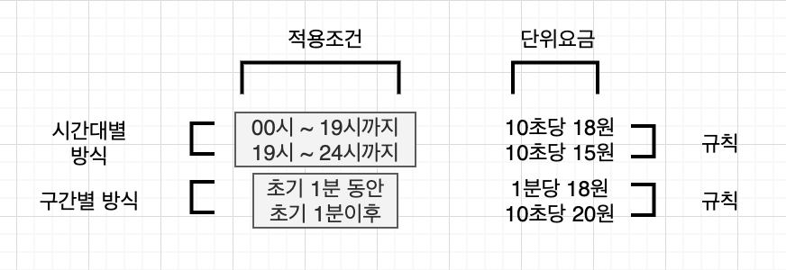
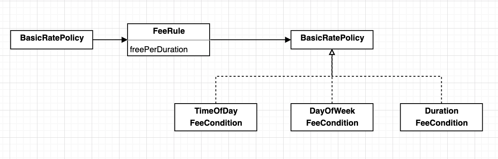

# 14. 일관성 있는 협력

객체는 협력을 위해 존재한다.

협력은 객체가 존재하는 이유와 문맥을 제공한다.

객체지향 설계의 목표는 적절한 책임을 수행하는 객체들의 협력을 기반으로 결합도가 낮고 재사용 가능한 코드 구조를 창조하는 것

객체지향 패러다임의 장점은 설계를 재사용할 수 있다는 것. 

재사용을 위해서는 객체들의 협력 방식을 일관성 있게 만들어야 한다. 

일관성 있는 설계가 주는 큰 이익은 코드가 이해하기 쉬워진다는 것. 

특정한 문제를 유사한 방법으로 해결하고 있다는 사실을 이해하는 것만으로도 코드의 구조를 예상할수 있다.

## 01. 핸드폰 과금 시스템 변경하기

### 기본 정책 확장

| 유형          | 형식                                                         | 예                                                           |
| ------------- | ------------------------------------------------------------ | ------------------------------------------------------------ |
| 고정요금 방식 | A초당 B원                                                    | 10초당18원                                                   |
| 시간대별 방식 | A시부터 B시까지 C초당 D원  B시부터 C시까지 C 초당 E원     | 00시부터 19시까지 10초당 18원 19시부터 24시까지 10초당 15원 |
| 요일별 방식   | 평일에는 A 초당 B원  공휴일에는 A초당 C원                 | 평일에는 10초당 38원 공휴일에는 10초당 19원               |
| 구간별 방식   | 초기 A분 동안 B초당 C원  A분 ~ D분까지 B 초당 D 원  D분 초과 시 B초당 G원 | 초기 1분동안 10초당 50원    초기 1분 이후 10초당 20원     |

**이번 장에서 구현할 기본 정책의 클래스 구조**

### 고정요금 방식 구현하기

### 시간대별 방식 구현하기

### 요일별 방식 구현하기

### 구간별 방식 구현하기

**코드 재사용을 위한 상속은 해롭다.**

> 

## 02. 설계에 일관성 부여하기

**협력을 일관성 있게 만들기 위한 기본지침**

* 변하는 개념을 변하지 않는 개념으로부터 분리하라.
* 변하는 개념을 캡슐화하라.

`바뀌는 부분을 따로 뽑아서 캡슐화 한다. 그렇게 하면 나중에 바뀌지 않는 부분에는 영향을 미치지 않은 채로 그 부분만 고치거나 확장할 수 있다.`

### 조건 로직 대 객체 탐색

**일관성 있는 협력을 위한 지침 1**

> 변하는 개념을 변하지 않는 개념으로부터 분리하라.

**일관성 있는 협력을 위한 지침 2**

> 변하는 개념을 캡슐화 하라

### 캡슐화 다시 살펴보기

`캡슐화란 변하는 어떤 것이든 감추는 것`

**메시지에 의해 정의된 퍼블릭 인터페이스는 객체 내부를 캡슐화한다.**

캡슐화란 단순히 데이터를 감추는 것이 아닌 변할수 있는 어떤`개념`이라도 감추는 것.

* 데이터 캡슐화
  * 내부에 관리하는 데이터를 캡슐화
* 메서드 캡슐화
  * Prcetected 선언으로 클래스 내부에서만 사용가능. 클래스의 내부 행동을 캡슐화
* 객체 캡슐화
  * 객체와 객체 사이의 관계를 캡슐화. 
  * 객체 캡슐화가 합성이다. 
* 서브타입 캡슐화

**변하는 부분을 분리해서 타입 계층을 만든다**

> 변하지 않는 부분으로부터 변하는 부분을 분리한다. 변하는 ㅜ분들의 공통적인 행동을 추상 클래스나 인터페이스로 추상화한 후 변하는 부분들이 이 추상 클래스나 인터페이스를 상속받게 만든다.

**변하지 않는 부분의 일부로 타입 계층을 합성한다.**

> 

## 03 일관성 있는 기본 정책 구현하기

### 변경 분리하기

**변하는 부분의 적용조건**

변하지 않는 `규칙`으로부터 변하는 `적용조건`을 분리해야한다.

### 변경 캡슐화하기

**변경을 캡슐화하는 기본 정책과 관련된 초기 도메인 모델**

### 협력 패턴 설계하기

### 추상화 수준에서 협력 패턴 구현하기

### 구체적인 협력 구현하기

유사한 기능에 대해 유사한 협력 패턴을 적용하는 것은 객체지향 시스템에서 **개념적 무결성(Conceptual Integrity)** 을 유지할 수 있는 가장 효과적인 방법이다. 

> 저자는 개념적 무결성이 시스템 설계에서 가장 중요하다고 감히 주장한다. 좋은 기능들이긴 하지만 서로 독립적이고 조화되지 못한 아이디어들을 담고 있는 시스템보다는 여러가지 다양한 기능이나 갱신된 내용은 비록 빠졌더라도 하나의 통합된 일련의 설계 아이디어를 반영하는 시스템이 훨씬 좋다.

### 협력 패턴에 맞추기

**지속적으로 개선하라**

> 처음 일관성을 유지하는 것처럼 보이던 협력 패턴이 시간이 흐르면서 새로운 요구사항이 추가되는 과정에서 일관성의 벽에 조금씩 금이 가는 경우를 자주 보게 된다. 협력을 걸계하는 초기 단계에서 모든 요구사항을 미리 예상할 수 없기때문에 이것은 잘못이 아니며 꽤나 자연스러운 현상이다. 오히려 새로운 요구사항을 수용할 수 있는 협력 패턴을 향해 설계를 진화시킬수 있는 좋은 신호로 받아들여야 한다. 
>
> 협력은 고정된 것이 아니다. 현재의 협력 패턴이 변경의 무게를 지탱하기 어렵다면 변경을 수용할 수 있는 협력 패턴을 향해 과감하게 리팩터링하라. 요구사항의 변경에 따라 협력 역시 지속적으로 개선해야 한다. 중요한 것은 현재의 설계에 맹목적으로 일관성을 맞추는 것이 아니라 달라지는 **변경의 방향에 맞춰 지속적으로 코드를 개선하려는 의지다.**

### 패턴을 찾아라

> 객체지향 설계는 객체의 행동과 그것을 지원하기 위한 구조를 계속 수정해 나가는 작업을 반복해 나가면서 다듬어진다. 객체, 역할, 책임은 계속 진화해 나가는 것이다. 협력자들 간에 부하를 좀 더 균형 있게 배분하는 방법을 새로 만들어내면 나눠줄 책임이 바뀌게 된다. 만약 객체들이 서로 통신하는 방법을 개선해냈다면 이들 간의 상호작용은 재정의되야 한다. 이 같은 과정을 거치면서 객체들이 자주 통신하는 경로는 더욱 횯율적이게 되고, 주어진 작업을 수행하는 표준 방안이 정착된다. 협력 패턴이 드러나는 것이다.